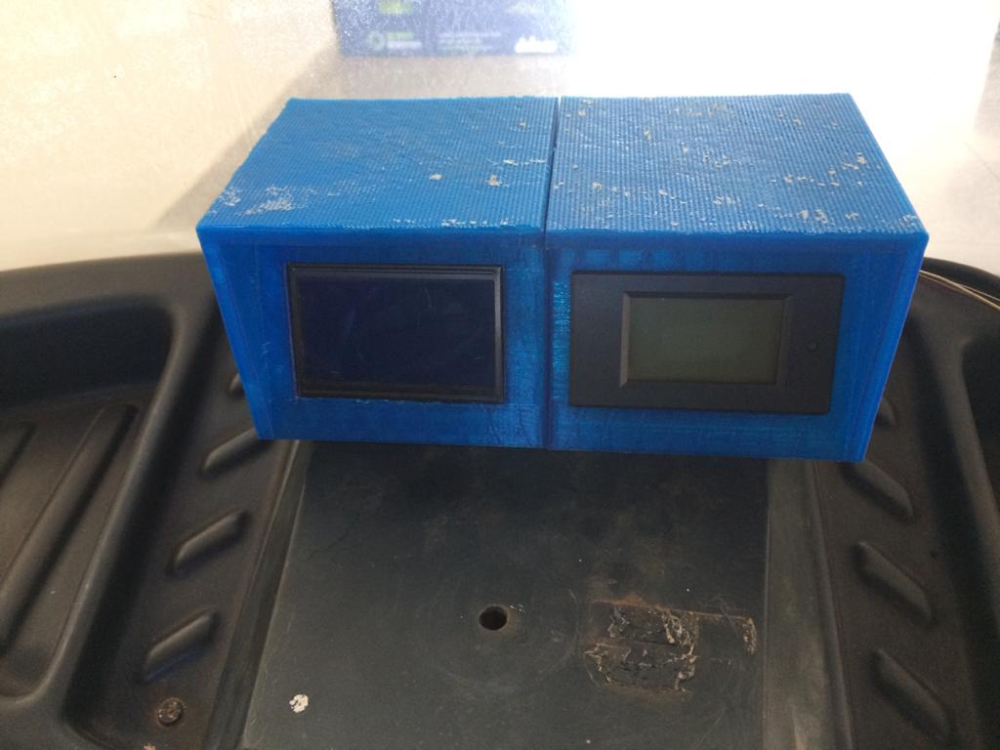

# 1. Gama Golfe
O campus Gama tem a disposição um carro de golfe, que foi batizado com o nome de GamaGolge (GG). 
Este veículo está sendo usado para o uso dia-a-dia das atividades de transporte de material e de pessoas do campus Gama e também está sendo usado para pesquisas e experimentos de mobilidade elétrica.

A figura a seguir mostra outra foto do GG.

A primeira experiência foi uma pesquisa de trabalho de conclusão de curso de engenharia automotiva de implementar para transformar o carrinho de golfe num veículo elétrico híbrido série [1].

Um outro trabalho de conclusão de curso desenvolveu um computador de bordo para o GamaGolfe.

[1] Costa de Oliveira T. Estudo da tecnologia empregada em veículos elétricos com autonomia estendida: comparativo cxperimental com veiculos híbridos. Universidade de Brasília, 2018.

# 2. Plataforma de ensino e pesquisa

A grande vantagem do GamaGolfe é que tem uma estrutura de acionamento e controle bastante simplificado e accessível que permite que se possa usar o veículo como uma plataforma de ensino e pesquisa. 

O sistema de acionamento e controle de movimentação é bastante simples com um controlador de motor de corrente conínua com um banco de bateria de 48Vcc. 

Além disso, o GG tem uma sistema de sinalização bastante simples, com sinalização de setas e iluminação.
A versão original do GG tem somente um sistema de indicação de carga de bateria, sem sistema BMS, indicação de tensão e corrente, ou carga da bateria.

O banco de baterias é formado por 4 baterias de automotiva  de 100Ah.

# 3. Proposta de arquitetura

Dessa forma se propõe as seguintes funções ou possibilidades:

* funcionalidade de carregar a bateria de forma inteligente com medição do consumo de energia e calculo de estado de carag;
* funcionalidade de de monitorar a corrente e a tensão da bateria, com calculo de energia consumida;
* monitorar a velocidade de deslocamento e outros sinais cruziais do GG;
* funcionalidade de registrar o percurso do veículo por meio de GPS;
* visualisar todos os variaveis do veículo por meio de um servidor SCADA em tempo real;
* criar estratégias para viabilizar a movimentação autônoma do GG;

Estrutura para implementar essas funcionalidades será composto pelos seguintes módulos de hardware e software: 

* Módulo de instrumentação; 
* Computador de bordo Pocket Beagle om rede CAN;
* Módulo de sinalização;
* Módulo BMS;
* Servidor SCADA;
* Módulo de direção e aceleração assistida;

## 3.1. Módulo de instrumentação 

* Sensor de velocidade
* Sensor de tensão da bateria de 12Volts
* Sensor de tensão do banco de bateria de 48Volts
* Sensor de corrente do banco de bateria

 
O sensor de velocidade é implementado por meio de um sensor indutivo de aproximação montada no cubo da roda dianteira, onde a cada volta o sensor pega 4 pulsos.

O sensor indutivo aparentemente é da configuração PNP com a seguinte pinagem

| cor | função |
|-----|--------|
| marron | alimentação 12Vdc |
| preto  | sinal (deve ligar um resistor 10K para negativa ) |
| azul   | negativa |

O painel do módulo de instrumentação é mostada na figura seguinte. No lado direito do painel são mostrados as variáveis elétricas, tensão e corrente da bateria, enquanto no lado esquerda são mostrados os valores de velocidade, odômetro e outras variaveis do veículo.

### 3.1.1 Calibragem do sensor de velocidade

Numa primeira calibragem, a circumferência da roda, ou a distância de uma volta completa da roda é de 99 cm. Numa volta completa o sensor gera 4 pulsos.

## 3.2. Computador de bordo

## 3.3. Módulo de sinalização

O sistema de sinalização de setas e iluminação

