# Gama Golfe

link para arquivo original `Documentos/GitHub/GamaGolf`

O campus Gama tem a disposição um carro de golfe, que foi batizado com o nome de GamaGolge (GG). 
Este veículo está sendo usado para o uso dia-a-dia das atividades de transporte de material e de pessoas do campus Gama e também está sendo usado para pesquisas e experimentos de mobilidade elétrica.

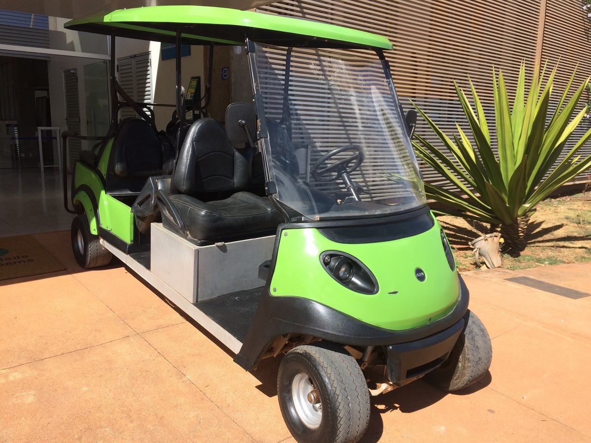

A figura a seguir mostra outra foto do GG.


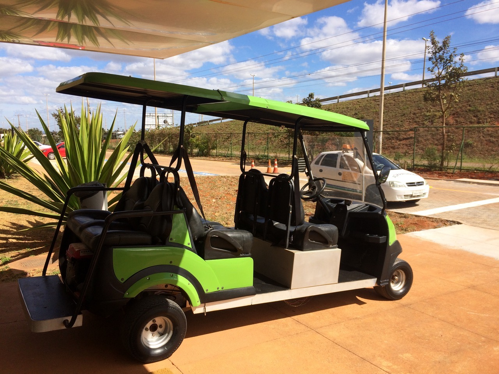

A primeira experiência foi uma pesquisa de trabalho de conclusão de curso de engenharia automotiva de implementar para transformar o carrinho de golfe num veículo elétrico híbrido série [1].

Um outro trabalho de conclusão de curso desenvolveu um computador de bordo para o GamaGolfe.


[1] Costa de Oliveira T. Estudo da tecnologia empregada em veículos elétricos com autonomia estendida: comparativo cxperimental com veiculos híbridos. Universidade de Brasília, 2018.


# 2. Plataforma de ensino e pesquisa

A grande vantagem do GamaGolfe é que tem uma estrutura de acionamento e controle bastante simplificado e accessível que permite que se possa usar o veículo como uma plataforma de ensino e pesquisa. 

O sistema de acionamento e controle de movimentação é bastante simples com um controlador de motor de corrente conínua com um banco de bateria de 48Vcc. 


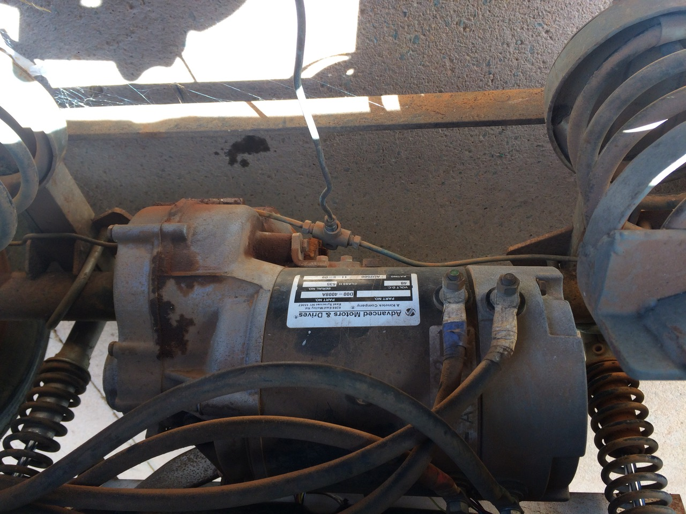

Além disso, o GG tem uma sistema de sinalização bastante simples, com sinalização de setas e iluminação.
A versão original do GG tem somente um sistema de indicação de carga de bateria, sem sistema BMS, indicação de tensão e corrente, ou carga da bateria.

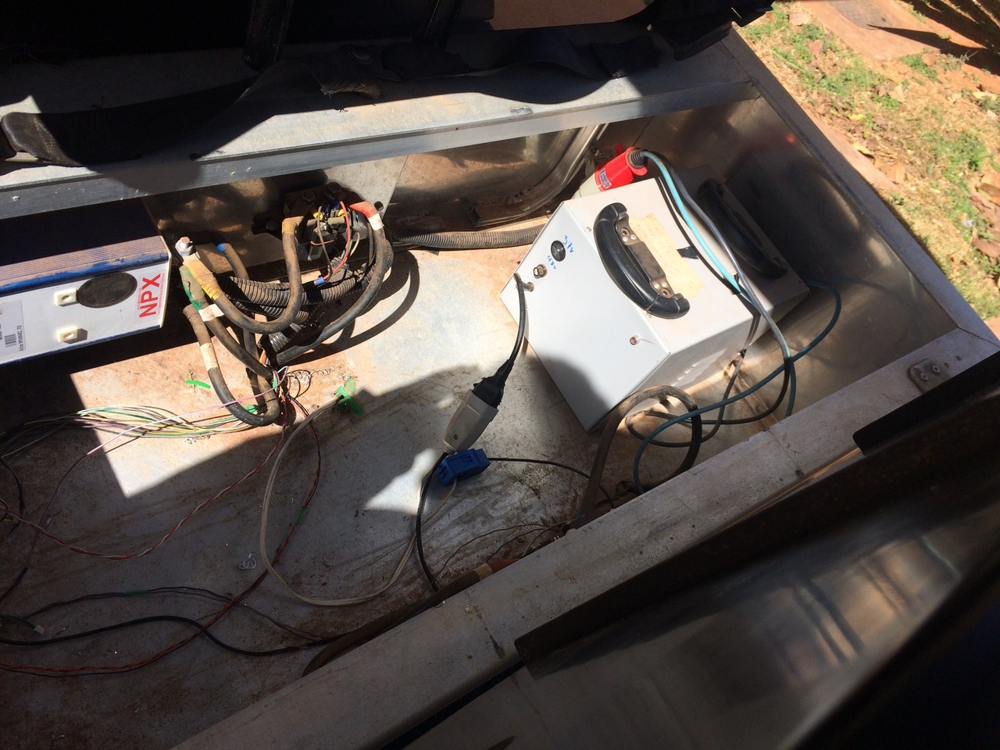


O banco de baterias é formado por 4 baterias de automotiva  de 100Ah. 

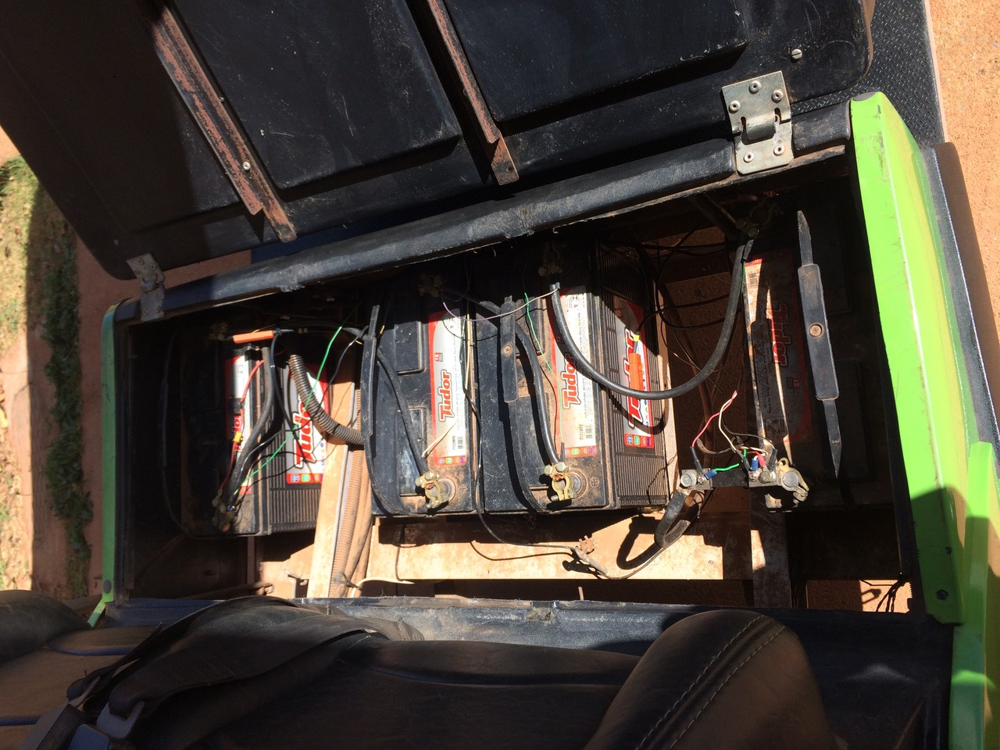

A primeira instrumentação instalada no GG foi um medidor de tensão e corrente simples sem registro de dados ou interface com um computador. 
O transdutor de corrente é implementado por meio de um shunt na saída da bateria. 
Na foto anterior é possível ver o transdutor de corrente (shunt) no terminal da primeira bateria.


A foto mostro o painel do medidor no dashboard do GG.
 
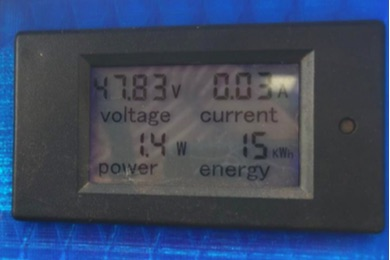


Com essa instrumentação muito simples foram realizados algumas experiências simples como parte de laboratório da disciplina de sistemas de conversão de energia. 
O ensaio consistia em filmar durante o percurso a tensão e a corrente do carrinho e depois fazer uma avaliação simples.
 
Alguns dos relatorios de ensaio com essa instrumentação podem ser acessados aqui: 

[relatório 1](anexos/Relatorio_GG_Henrique_Moura_160058651.pdf)

[relatório 2](anexos/Relatorio_Gama_Golfe_Ana_Luisa.pdf)

Entretanto é necessário a construção de um sistema de instrumentação e aquisição de dados mais robustas e escalonável.

A próxima secção apresenta uma proposta de arquitetura de aquisição de dados.


# 3. Proposta de arquitetura de instrumentação e automação

O sistema de instrumentação e automação deve ter as seguintes funções ou possibilidades:

* funcionalidade de carregar a bateria de forma inteligente com medição do consumo de energia e calculo de estado de carga;
* funcionalidade de monitorar a corrente e a tensão da bateria, com calculo de energia consumida;
* monitorar a velocidade de deslocamento e outros sinais cruziais do GG;
* funcionalidade de registrar o percurso do veículo por meio de GPS;
* visualisar todos os variaveis do veículo por meio de um servidor SCADA em tempo real ou off-line;
* criar estratégias para viabilizar a movimentação autônoma do GG;


A estrutura para implementar essas funcionalidades será composto pelos seguintes módulos de hardware e software: 

1. Módulo de instrumentação com interface CAN; 
2. Computador de bordo baseado no BeagleBone Black om rede CAN;
3. Módulo de sinalização com interface CAN;
4. Módulo BMS con interfce CAN;
5. Computador Servidor SCADA;
6. Módulo de direção e aceleração assistida com interface CAN;

Uma primeira versão do diagrama de blocos da arquitetura com a implementação mínima de computador de bordo e módulo de instrumentação é mostrada na figura a seguir.


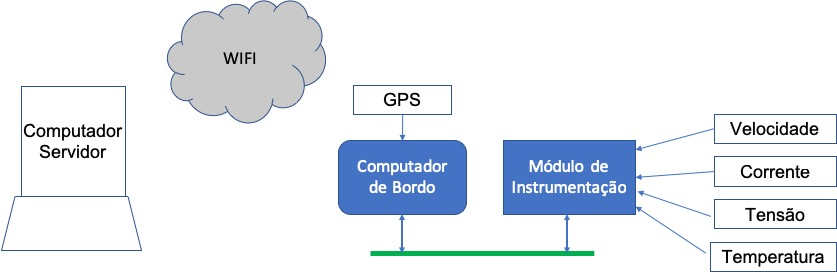 

Na medida que os demais módulos serão implementados eles serão interligados com os demais módulos pelo barramento de comunicação CAN.

## 3.1. Módulo de instrumentação 

O módulo de instrumentação é formado por uma placa de instrumentação com o seguinte esquema eletrônico.

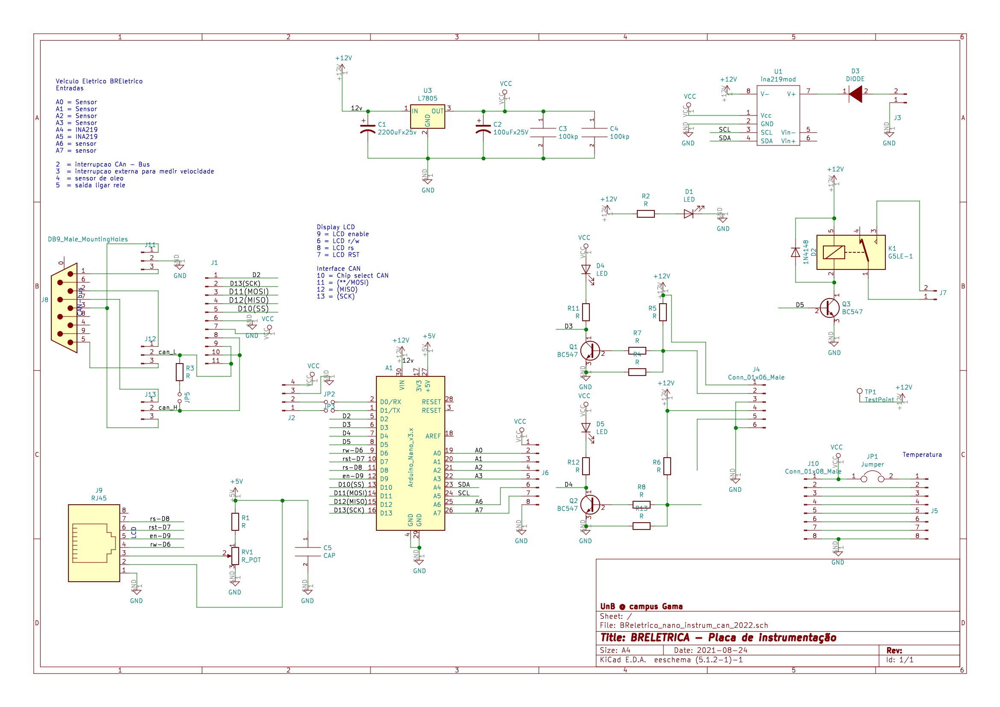

Essa placa de controle tem as seguintes funcionalidades :

* Sensor de velocidade
* Sensor de tensão da bateria estacionária de 12Volts
* Sensor de corrente da bateria estacionária de 12Volts
* Sensor de tensão do banco de bateria de tração de 48Volts
* Sensor de corrente do banco de bateria de tração 
* Display LCD de 128x64
* Interface CAN

A placa tem mais funcionalidades e pode ser programada para ler mais sensores. A figura a seguir mostra a placa de instrumentação sendo testado na bancada.

 
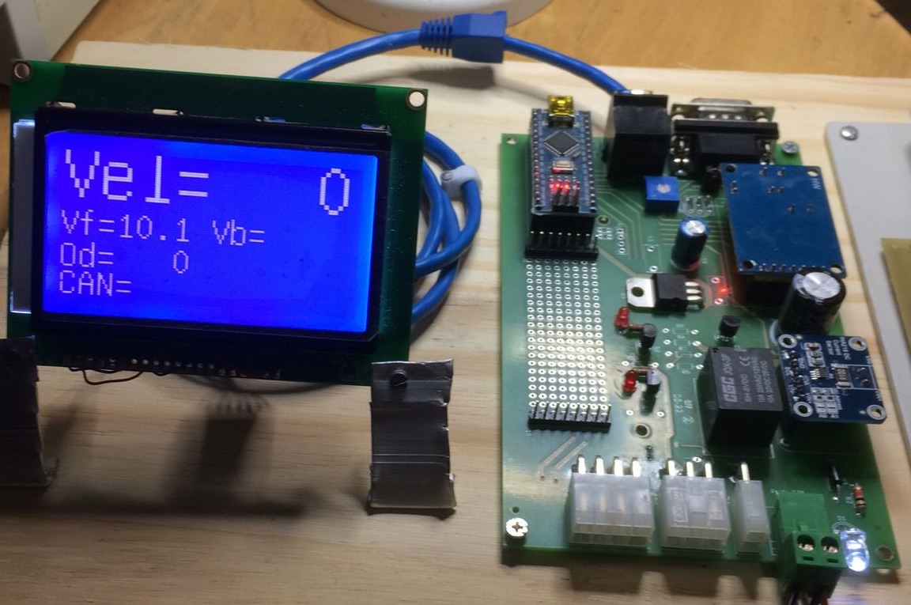 

### 3.1.1. Sensor de velocidade 
 
O sensor de velocidade é implementado por meio de um sensor indutivo de aproximação montada no cubo da roda dianteira, onde a cada volta o sensor pega 4 pulsos.

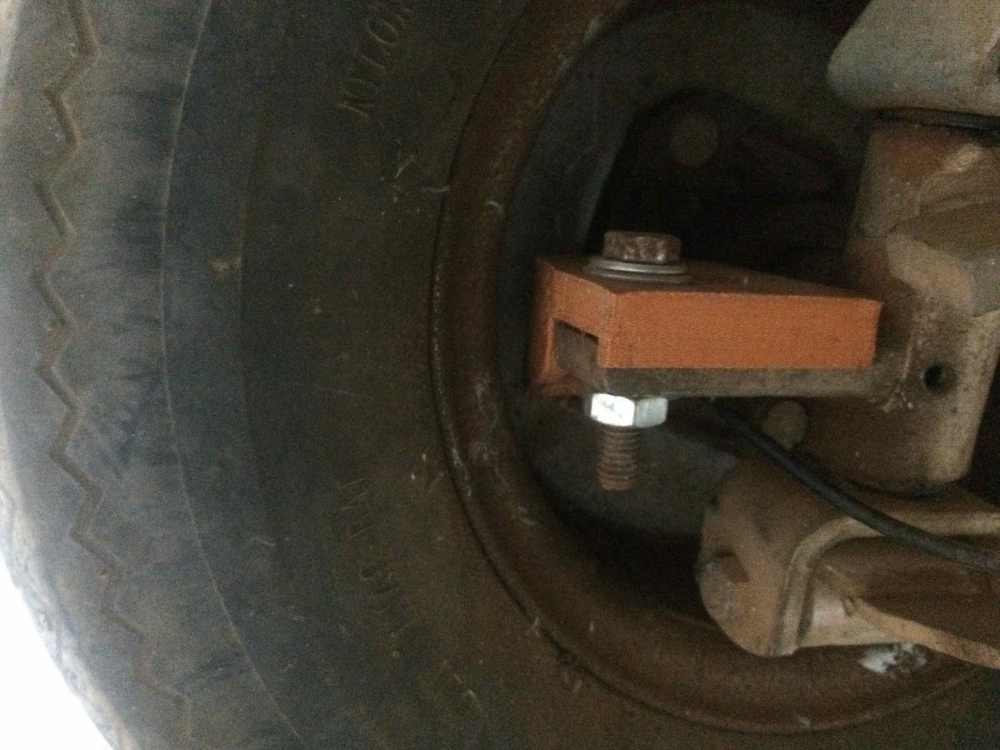

O sensor indutivo aparentemente é da configuração PNP com a seguinte pinagem

| cor | função |
|-----|--------|
| marron | alimentação 12Vdc |
| preto  | sinal (deve ligar um resistor 10K para negativa ) |
| azul   | negativa |

O display do módulo de instrumentação mostra a velocidade, deslocamento e as variáveis elétricas, tensão e corrente das baterias.

#### 3.1.1.1 Calibragem do sensor de velocidade

Numa primeira calibragem, a circumferência da roda, ou a distância de uma volta completa da roda é de 99 cm. Numa volta completa o sensor gera 4 pulsos.


### 3.1.2 Sensor de corrente

O sensor de corrente que está sendo usado no GamaGolfe é um sensor da LEM conforme mostrado na figura a seguir.
Este sensor será ligada em uma das entradas analógiacas do conector J5 

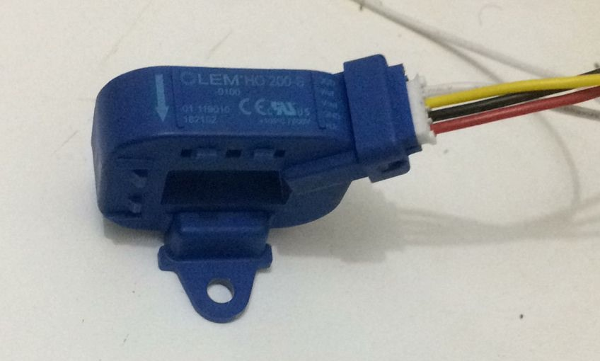

O sensor é alimentado com 5 volts e a sua sáida é um sinal analógico de xxx a xxx volts. 

Os pinos 1,2, e 8 do conector J5 ligam o sensor

| J5| 	função |	Sensor   |
|---|--------|------------|
| 1 | 5V     | cor do fio |  
| 2 | Sinal  | cor do fio |
| 8 | GND    | cor do fio |

[Datasheet do sensor de corrente](https://www.lem.com/sites/default/files/products_datasheets/ho_50_250-s-0100_series.pdf)


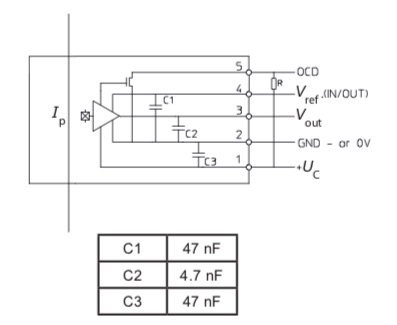


## 3.2. Computador de bordo OBC

O diagrama de blocos do computador de bordo é dado a seguir.

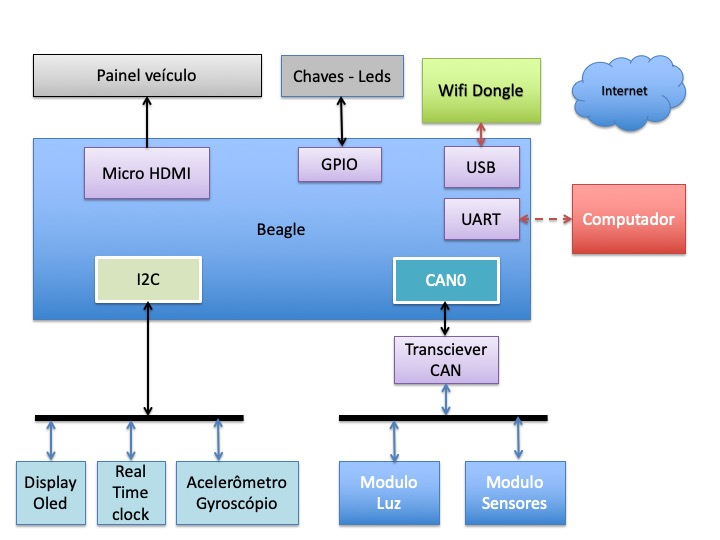

O computador de bordo tem a seguinte funcionalidade.

* GPS para pegar os coordenados geográficos
* Interface CAN
* Painel com chaves e leds
* Banco de dados para armazenar os dados
* Acesso por meio de rede Wifi

O OBC é implementado com o BeagleBone Black (BBB). A configuração é a mesma usado pelo OBC do BR800 que pode ser visto no [link](https://github.com/Tecnomobele-FGA/Computador-de-bordo).
A diferença é que no caso do GG é preciso ter a opção de um monitor com interface HDMI e por isso se escolheu o BBB. 

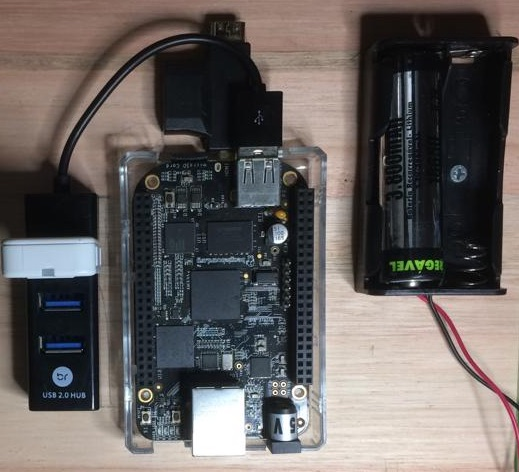

Os pinos usados são:

| Beagle  | uso             | pinos | 
|:--------|:---------------:|:-----:|
| CAN 0 RX | Barramento CAN | P9 - 19 |
| CAN 0 TX | Barramento CAN | P9 - 20 |
| UART 4 RXD | Serial GPS   | P9 - 11 | 
| UART 4 TXD | Serial GPS   | P9 - 13 |
| Power but | Desligar  | P9 - 09 |
| Reset but | reiniciar | P9 - 10 |
| + 3.3V  | Alimentação | P9 - 03 |
| + 5V  | Alimentação | P9 - 05 ou 07 |
| GND   | Alimentação | P9 - 01 |
| GND   | Alimentação | P9 - 02 |
| GPIO 50 | Chave 1  para GND | P9 - 12  | 
| GPIO 48 | Chave 2  para GND | P9 - 15  | 
| GPIO 49 | Chave 3  para GND | P9 - 23  | 
| GPIO 40 | Led 1    para GND | P9 - 14  | 
| GPIO 51 | Led 2    para GND | P9 - 16  | 
| GPIO 125 | Led 3    para GND | P9 - 27  | 
| AIN0    | Monitorar a tensão Vcc | P9 - 39 |

Ordem numerico


| Beagle  | uso             | pinos | 
|:--------|:---------------:|:-----:|
| GND     | Alimentação | P9 - 01 |
| GND     | Alimentação | P9 - 02 |
| + 3.3V    | Alimentação | P9 - 03 |
| + 5V      | Alimentação | P9 - 05 ou 07 |
| Power but | Desligar    | P9 - 09 |
| Reset but | reiniciar   | P9 - 10 |
| UART 4 RXD | Serial GPS   | P9 - 11 | 
| GPIO 50 | Chave 1  para GND | P9 - 12  | 
| UART 4 TXD | Serial GPS   | P9 - 13 |
| GPIO 40 | Led 1    para GND | P9 - 14  | 
| GPIO 48 | Chave 2  para GND | P9 - 15  | 
| GPIO 51 | Led 2    para GND | P9 - 16  | 
| CAN 0 RX | Barramento CAN | P9 - 19 |
| CAN 0 TX | Barramento CAN | P9 - 20 |
| GPIO 49 | Chave 2  para GND | P9 - 23  | 
| GPIO 125 | Led 3    para GND | P9 - 27  | 
| AIN0    | Monitorar a tensão Vcc | P9 - 39 |


A ligação da bateria Litium 18650 tem os seguintes pinos


| Beagle  | Designação            | pinos | 
|:--------|:---------------:|:-----:|
| Battery | Battery connection pint | TP5 | 
| Sense   | Battery voltage sense input, connecto to battery terminal  | TP6 | 
| TS | Temperature sense input  (termistor) | TP7 | 
| GND  | System ground  | TP8 | 

[Tutorial para ligar a bateria 1 ](http://beaglebone-asterisk.raspbx.org/uninterruptible-power-supply-ups-for-beaglebone-black-a-diy-project/)

[Tutorial para ligar a bateria 2](https://community.element14.com/products/devtools/single-board-computers/next-genbeaglebone/b/blog/posts/bbb---rechargeable-on-board-battery-system)

A placa de interface para ligar o BBB com a interface CAN é dado no esquema a seguir.

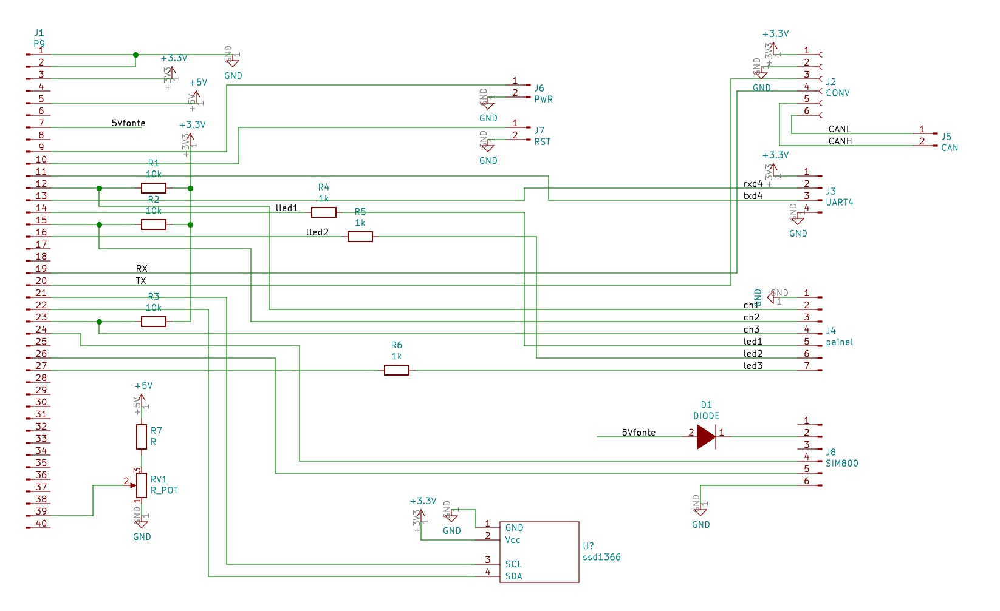

A montagem do OBC será no dashboard do veículo . 
A vista frontal do OBC é mostrado a seguir. 

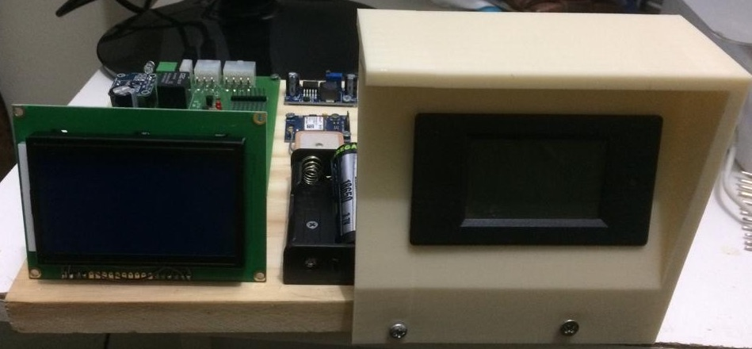

A vista de cima mostra a placa de instrumentação ao lado do computador de bordo conectado ao GPS e WiFi USB dongle. 

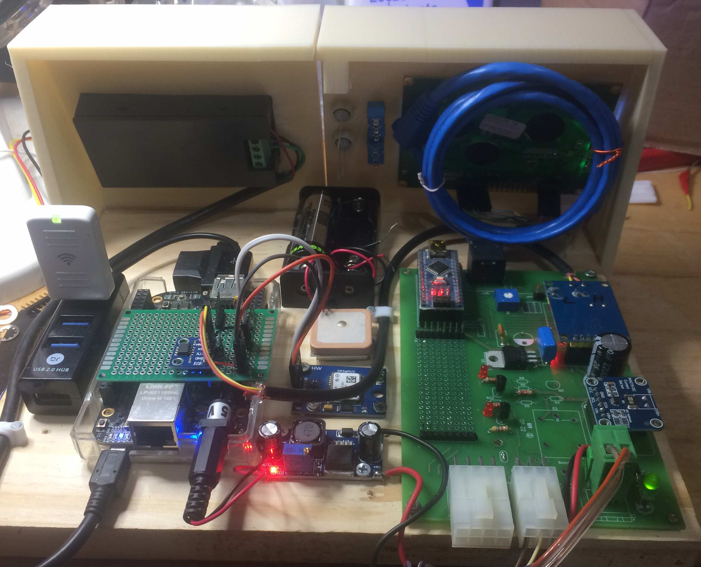

### 3.2.1. Configuração do BBB

A configuração BBB para habilitar o CAN BUS é diferente do [Pocket Beagle ](https://github.com/Tecnomobele-FGA/Computador-de-bordo).

Os pinos do BBB são diferentes do Pocket Beagle.


| BBB     | con | pino | transciever | pino |
|:-------:|:---:|:----:|:------:|:----:|
| 3.3v    | P9  | 3    | 3V3    | J2-1 | 
| gnd     | P9  | 1    | GND    | J2-2 |
| can0 tx | P9-20 | 20   | CTX    | J2-3 |
| can0 rx | P9-19 | 19   | CRX    | J2-4 |
| | | | CANH    | J2-5 |
| | | | CANL    | J2-6 | 

O programa `config-pin` configura os pinos do BBB para as diversas funcionalidades.

Para automatizar a configuração do CAN, criei um script para configurar as portas no arquivo `configcan.sh` na pasta `/home/debian/`


```
#!/bin/bash
echo "Iniciando as configuracoeas dos pinos para a rede CAN0."

config-pin P9.19 can
config-pin P9.20 can
sudo /sbin/ip link set can0 up type can bitrate 125000

echo "Pinos de CAN0 configurados!..."
```

Este programa tem que ser executado com superusário.


## 3.3. Módulo de sinalização

O sistema de sinalização de setas e iluminação é o mesmo usado pelo [BRElétrico](https://github.com/Tecnomobele-FGA/Modulo-luzes).
O GG tem já tem as chaves e iluminação e o sistema convencional é basicamente com relés e chaves ligando diretamente a sinalização.

A proposta é retirar a fiação atual do sistema de luzes e buzina e fazer um projeto completamente novo com base na placa de sinalização já disponível.

A foto a seguir mostra o "cabine" do GG onde vamos ter que instalar o novo sistema de sinalização.

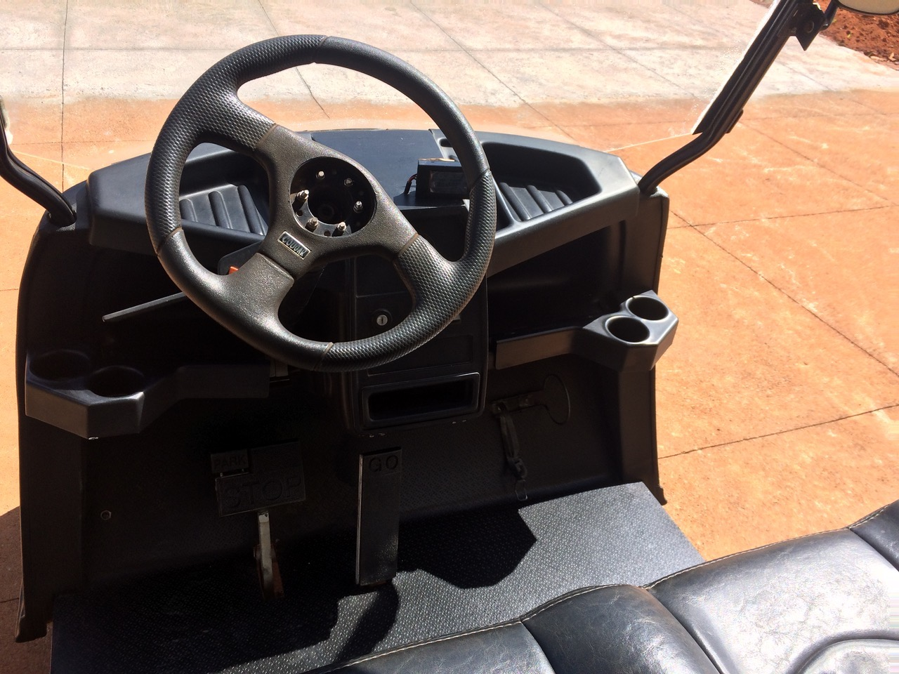


# 4. Software

# 4.1. Software Módulo instrumentação 

O módulo de instrumantação tem um Arduino Nano como microcontrolador.
O programa usa a biblioteca CAN da 
[travis-ci Arduino MCP2515 CAN interface library](https://travis-ci.org/autowp/arduino-mcp2515).

O programa basicamente mede os dados velocidade e dados elétricos e mostra no display a cada ciclo do programa principal e a cada 500 milisegundos disponibiliza estes dados no barramento CAN por meio de um datagram conforme mostrado no trecho do programa principal do Arduino.


```
void loop(void) {
 char c;
 le_sensores();
 le_velocidade();
 le_ina219(); 
 u8g.firstPage();  /* imprimindo no LCD */
 do {
      draw();   
 } while( u8g.nextPage() );
 if (tempor_can1 >= 5)
 {
  tempor_can1=0;
  canMsg1.can_id = 0x10FEBF90 | CAN_EFF_FLAG;  //  testando com 0x90FEBF90 tambem funcionou
  canMsg1.can_dlc = 8;
  canMsg1.data[0] = (Velocidade_Int & 0x00FF); //  (Velocidade_Int & 0x00FF);
  canMsg1.data[1] = (Velocidade_Int >> 8) & 0x00FF; //(Velocidade_Int >> 8) & 0x00FF;
  canMsg1.data[2] = 0xFF;
  canMsg1.data[3] = 0xFF;  
  canMsg1.data[4] = 0xFF;  
  canMsg1.data[5] = 0xFF;  
  canMsg1.data[6] = 0xFF; 
  canMsg1.data[7] = 0xFF;
  mcp2515.sendMessage(&canMsg1);
 } 
 if (tempor_can2 >= 5)
 {
  tempor_can2=0;
  Voltage_Int=Sensor_1_Int;
  Current_Int=Sensor_2_Int;
  canMsg1.can_id = 0x10088A9E | CAN_EFF_FLAG; 
  canMsg1.can_dlc = 8;
  canMsg1.data[0] = (Voltage_Int & 0x00FF);  
  canMsg1.data[1] = (Voltage_Int >> 8) & 0x00FF;
  canMsg1.data[2] = (Current_Int & 0x00FF); 
  canMsg1.data[3] = (Current_Int >> 8) & 0x00FF;  
  canMsg1.data[4] = 0xFF;  
  canMsg1.data[5] = 0xFF;  
  canMsg1.data[6] = 0xFF; 
  canMsg1.data[7] = 0xFF;
  mcp2515.sendMessage(&canMsg1);
 }
} 
```
O programa garante que as duas datagramas não são inseridos um aoutras do outro no barramento para garantr tempo de processamento ao computador de bordo.
A velcidade de comunicação é de 125kbps. 

O formato das mensagens foi baseado no J1939 usado no BRELétrico e o dicionário de dados se encontra no arquivo `src/DBC/BRELETmotorV2.dbc`    

Para ver o dicionário pode se usar o comando `python3 -m cantools monitor -c can0 -B 125000 src/DBC/BRELETmotorV2.dbc`    


# 4.2. Software OBC

O programa do OBC tem que inicializar o CAN0, habilitar as chaves e leds do painel, abrir a porta serial do GPS e monitorar os dados do barramento CAN e gravar estes dados num banco de dados no próprio OBC.

Além disso, o programa também precisa disponibilizar os dados para acesso via internet (quando está ligada na rede intranet do campus) em tempo real por meio de um protocolo de comunicação. 

Escolheu-se usar o sistema gerenciador de banco de dados MariaDB que implementa o padrão SQL.
O OBC neste caso foi configurado como servidor de banco de dados e pode receber requisições via comandos SQL pela internet.

Para a comunicação em tempo real, escolheu-se o protocolo MODBUS-IP onde o OBC funciona como estação escravo.

O programa a seguir mostra parte da implementação do servidor MODBUS-IP e o monitoramento do barramento CAN. 

Não se teve nessa fase preocupação com a otimização dos recursos no OBC e por isso o programa foi feito em Python priorizando o entendimento do código e facilidade de implementação.

Criou-se um objeto Painel que faz todas as operações de leitura das chaves e acionamento dos leds.


```
#!/bin/python3

import can 
import cantools
from pprint import pprint

from pyModbusTCP.server import ModbusServer, DataBank
from time import sleep
from random import uniform

from PainelObcGG import painel

print("Dados do DBC")
db = cantools.database.load_file('../DBC/BRELETmotorV2.dbc')

print("Abrindo CAN0")
can_bus=can.interface.Bus(bustype='socketcan', channel='can0', bitrate=125000)

print("Abrindo Modbus")
server = ModbusServer("192.168.1.5",5020, no_block=True)
input_reg_velocidade=10
input_reg_voltage=11
input_reg_current=12
input_status_chaves=10

Painel = painel()
voltage=0
velocidade=0
current=0

try:
    print("Iniciando server")
    server.start()
    print("Online")
    sleep(1)

    while True:
        sleep(0.01)
        Painel.read()
        DataBank.set_bits(input_status_chaves, [Painel.chave1, Painel.chave2, Painel.chave3])
        mensagem = can_bus.recv(0.0)
        if mensagem is not None :
            mm=db.decode_message(mensagem.arbitration_id, mensagem.data) 
            if mensagem.arbitration_id == db.get_message_by_name('MODINSTRUM').frame_id : 
                if 'Velocity' in mm :
                    velocidade=mm["Velocity"]
                    DataBank.set_words(input_reg_velocidade, [int(velocidade)])  
            if mensagem.arbitration_id == db.get_message_by_name('EVEC2').frame_id : 
                if 'Voltage' in mm :
                    voltage=mm["Voltage"]
                    DataBank.set_words(input_reg_voltage, [int(voltage)])
                if 'Current' in mm :
                    voltage=mm["Current"]
                    DataBank.set_words(input_reg_current, [int(current)])         
                    
            print("can -> modbus= " + str(velocidade) + " km/h, " + str(voltage) + " V, "+ str(current) + " Amp, " + str([Painel.chave1, Painel.chave2, Painel.chave3]), end = '\r')

except:
     print("Shutting down")
     server.stop()
     print("Off line")


```