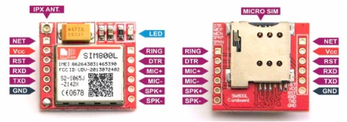

# Gama Golfe

link para arquivo original `Documentos/GitHub/GamaGolf`

[github.com/rudivels/GamaGolf](https://github.com/rudivels/GamaGolf)

# 1. Apresentação 
O campus Gama tem a disposição um carro de golfe, que foi batizado com o nome de GamaGolge (GG). 
Este veículo está sendo usado para o uso dia-a-dia das atividades de transporte de material e de pessoas do campus Gama e também está sendo usado para pesquisas e experimentos de mobilidade elétrica.


A figura a seguir mostra outra foto do GG.


A primeira experiência foi uma pesquisa de trabalho de conclusão de curso de engenharia automotiva de implementar para transformar o carrinho de golfe num veículo elétrico híbrido série [1].

Um outro trabalho de conclusão de curso desenvolveu um computador de bordo para o GamaGolfe.


[1] Costa de Oliveira T. Estudo da tecnologia empregada em veículos elétricos com autonomia estendida: comparativo cxperimental com veiculos híbridos. Universidade de Brasília, 2018.


# 2. Plataforma de ensino e pesquisa

A grande vantagem do GamaGolfe é que tem uma estrutura de acionamento e controle bastante simplificado e accessível que permite que se possa usar o veículo como uma plataforma de ensino e pesquisa. 

O sistema de acionamento e controle de movimentação é bastante simples com um controlador de motor de corrente conínua com um banco de bateria de 48Vcc. 


A documentação do controlador NPX está nos links:

[Documentacao 1](anexos/Doc100-057-A_SPEC-NPX-Product-Family.pdf)

[Documentacao 2](anexos/Doc100-035-A_DWG-Heatsink-Short-Mounting-Pattern-1.pdf)


[Documentacao 3](anexos/Doc100-013-C_OP-NPX-Mini-Man.pdf)

Além disso, o GG tem uma sistema de sinalização bastante simples, com sinalização de setas e iluminação.
A versão original do GG tem somente um sistema de indicação de carga de bateria, sem sistema BMS, indicação de tensão e corrente, ou carga da bateria.


O banco de baterias é formado por 4 baterias de automotiva  de 100Ah. 


A primeira instrumentação instalada no GG foi um medidor de tensão e corrente simples sem registro de dados ou interface com um computador. 
O transdutor de corrente é implementado por meio de um shunt na saída da bateria. 
Na foto anterior é possível ver o transdutor de corrente (shunt) no terminal da primeira bateria.


A foto mostro o painel do medidor no dashboard do GG.
 


Com essa instrumentação muito simples foram realizados algumas experiências simples como parte de laboratório da disciplina de sistemas de conversão de energia. 
O ensaio consistia em filmar durante o percurso a tensão e a corrente do carrinho e depois fazer uma avaliação simples.
 
Alguns dos relatorios de ensaio com essa instrumentação podem ser acessados aqui: 

[relatório 1](anexos/Relatorio_GG_Henrique_Moura_160058651.pdf)

[relatório 2](anexos/Relatorio_Gama_Golfe_Ana_Luisa.pdf)

Entretanto é necessário a construção de um sistema de instrumentação e aquisição de dados mais robustas e escalonável.

A próxima secção apresenta uma proposta de arquitetura de aquisição de dados.


# 3. Proposta de arquitetura de instrumentação e automação

O sistema de instrumentação e automação deve ter as seguintes funções ou possibilidades:

* funcionalidade de carregar a bateria de forma inteligente com medição do consumo de energia e calculo de estado de carga;
* funcionalidade de monitorar a corrente e a tensão da bateria, com calculo de energia consumida;
* monitorar a velocidade de deslocamento e outros sinais cruziais do GG;
* funcionalidade de registrar o percurso do veículo por meio de GPS;
* visualisar todos os variaveis do veículo por meio de um servidor SCADA em tempo real ou off-line;
* criar estratégias para viabilizar a movimentação autônoma do GG;


A estrutura para implementar essas funcionalidades será composto pelos seguintes módulos de hardware e software: 

1. Módulo de instrumentação com interface CAN; 
2. Computador de bordo baseado no BeagleBone Black om rede CAN;
3. Módulo de sinalização com interface CAN;
4. Módulo BMS con interfce CAN;
5. Computador Servidor SCADA;
6. Módulo de direção e aceleração assistida com interface CAN;

Uma primeira versão do diagrama de blocos da arquitetura com a implementação mínima de computador de bordo e módulo de instrumentação é mostrada na figura a seguir.


 

Na medida que os demais módulos serão implementados eles serão interligados com os demais módulos pelo barramento de comunicação CAN.

## 3.1. Módulo de instrumentação 

O módulo de instrumentação é formado por uma placa de instrumentação com o seguinte esquema eletrônico.


Essa placa de controle tem as seguintes funcionalidades :

* Sensor de velocidade
* Sensor de tensão da bateria estacionária de 12Volts
* Sensor de corrente da bateria estacionária de 12Volts
* Sensor de tensão do banco de bateria de tração de 48Volts
* Sensor de corrente do banco de bateria de tração 
* Display LCD de 128x64
* Interface CAN

A placa tem mais funcionalidades e pode ser programada para ler mais sensores. A figura a seguir mostra a placa de instrumentação sendo testado na bancada.

 
 

### 3.1.1. Sensor de velocidade 
 
O sensor de velocidade é implementado por meio de um sensor indutivo de aproximação montada no cubo da roda dianteira, onde a cada volta o sensor pega 4 pulsos.


O sensor indutivo aparentemente é da configuração PNP com a seguinte pinagem

| cor | função |
|-----|--------|
| marron | alimentação 12Vdc |
| preto  | sinal (deve ligar um resistor 10K para negativa ) |
| azul   | negativa |

O display do módulo de instrumentação mostra a velocidade, deslocamento e as variáveis elétricas, tensão e corrente das baterias.

#### 3.1.1.1 Calibragem do sensor de velocidade

Numa primeira calibragem, a circumferência da roda, ou a distância de uma volta completa da roda é de 99 cm. Numa volta completa o sensor gera 4 pulsos.


### 3.1.2 Sensor de corrente

O sensor de corrente que está sendo usado no GamaGolfe é um sensor da LEM conforme mostrado na figura a seguir.
Este sensor será ligada em uma das entradas analógiacas do conector J5 


O sensor é alimentado com 5 volts e a sua sáida é um sinal analógico de xxx a xxx volts. 

Os pinos 1,2, e 8 do conector J5 ligam o sensor

| J5| 	função |	Sensor   |
|---|--------|------------|
| 1 | 5V     | cor do fio |  
| 2 | Sinal  | cor do fio |
| 8 | GND    | cor do fio |

[Datasheet do sensor de corrente](https://www.lem.com/sites/default/files/products_datasheets/ho_50_250-s-0100_series.pdf)


### 3.1.2. calibração do sensor de corrente
Necessidade de calibração e descrever seu procedimento.


## 3.2. Computador de bordo OBC

O diagrama de blocos do computador de bordo é dado a seguir.


O computador de bordo tem a seguinte funcionalidade.

* GPS para pegar os coordenados geográficos
* Interface CAN
* Painel com chaves e leds
* Banco de dados para armazenar os dados
* Acesso por meio de rede Wifi

O OBC é implementado com o BeagleBone Black (BBB). A configuração é a mesma usado pelo OBC do BR800 que pode ser visto no [link](https://github.com/Tecnomobele-FGA/Computador-de-bordo).
A diferença é que no caso do GG é preciso ter a opção de um monitor com interface HDMI e por isso se escolheu o BBB. 


Os pinos usados são:

| Beagle  | uso             | pinos | 
|:--------|:---------------:|:-----:|
| CAN 0 RX | Barramento CAN | P9 - 19 |
| CAN 0 TX | Barramento CAN | P9 - 20 |
| UART 4 RXD | Serial GPS   | P9 - 11 | 
| UART 4 TXD | Serial GPS   | P9 - 13 |
| Power but | Desligar  | P9 - 09 |
| Reset but | reiniciar | P9 - 10 |
| + 3.3V  | Alimentação | P9 - 03 |
| + 5V  | Alimentação | P9 - 05 ou 07 |
| GND   | Alimentação | P9 - 01 |
| GND   | Alimentação | P9 - 02 |
| GPIO 50 | Chave 1  para GND | P9 - 12  | 
| GPIO 48 | Chave 2  para GND | P9 - 15  | 
| GPIO 49 | Chave 3  para GND | P9 - 23  | 
| GPIO 40 | Led 1    para GND | P9 - 14  | 
| GPIO 51 | Led 2    para GND | P9 - 16  | 
| GPIO 125 | Led 3    para GND | P9 - 27  | 
| AIN0    | Monitorar a tensão Vcc | P9 - 39 |
| UART 1 TXD | Serial SIM800   | P9 - 24 |
| UART 1 RXD | Serial SIM800   | P9 - 26 | 
| I2C SCL | Display OLED | P9 - 21 |
| I2C SDA | Display OLED | P9 - 22 |


Ordem numerico


| Beagle  | uso             | pinos | 
|:--------|:---------------:|:-----:|
| GND     | Alimentação | P9 - 01 |
| GND     | Alimentação | P9 - 02 |
| + 3.3V    | Alimentação | P9 - 03 |
| + 5V      | Alimentação | P9 - 05 ou 07 |
| Power but | Desligar    | P9 - 09 |
| Reset but | reiniciar   | P9 - 10 |
| UART 4 RXD | Serial GPS   | P9 - 11 | 
| GPIO 50 | Chave 1  para GND | P9 - 12  | 
| UART 4 TXD | Serial GPS   | P9 - 13 |
| GPIO 40 | Led 1    para GND | P9 - 14  | 
| GPIO 48 | Chave 2  para GND | P9 - 15  | 
| GPIO 51 | Led 2    para GND | P9 - 16  | 
| CAN 0 RX | Barramento CAN | P9 - 19 |
| CAN 0 TX | Barramento CAN | P9 - 20 |
| I2C SCL | Display OLED | P9 - 21 |
| I2C SDA | Display OLED | P9 - 22 |
| GPIO 49 | Chave 2  para GND | P9 - 23  | 
| UART 1 TXD | Serial SIM800   | P9 - 24 |
| UART 1 RXD | Serial SIM800   | P9 - 26 | 
| GPIO 125 | Led 3    para GND | P9 - 27  | 
| AIN0    | Monitorar a tensão Vcc | P9 - 39 |


A placa de interface para ligar o BBB com a interface CAN é dado no esquema a seguir.


A montagem do OBC será no dashboard do veículo . 
A vista frontal do OBC é mostrado a seguir. 


A vista de cima mostra a placa de instrumentação ao lado do computador de bordo conectado ao GPS e WiFi USB dongle. 


### 3.2.1 Bateria Litium  Nobreak

O BBB tem um conector na placa para ligar uma bateria Litium 18650 e um termistor para monitorar a temperatura da bateria e que tem os seguintes pinos


| Beagle  | Designação            | pinos | 
|:--------|:---------------:|:-----:|
| Battery | Battery connection pint | TP5 | 
| Sense   | Battery voltage sense input, connecto to battery terminal  | TP6 | 
| TS | Temperature sense input  (termistor) | TP7 | 
| GND  | System ground  | TP8 | 

Os pinos TP5 e TP6 foram interligados (curto) e para emular o termistor foi colocado um resistor de 10K Ohms entre os terminais TP8 e TP7.
O conector positivo da bateria foi colocado no TP5 e TP6 enquanto o pino negativo foi colocado no TP8.

[Tutorial para ligar a bateria 1 ](http://beaglebone-asterisk.raspbx.org/uninterruptible-power-supply-ups-for-beaglebone-black-a-diy-project/)

[Tutorial para ligar a bateria 2](https://community.element14.com/products/devtools/single-board-computers/next-genbeaglebone/b/blog/posts/bbb---rechargeable-on-board-battery-system)


### 3.2.2. Configuração do CAN do BBB

A configuração BBB para habilitar o CAN BUS é diferente do [Pocket Beagle ](https://github.com/Tecnomobele-FGA/Computador-de-bordo).

Os pinos do BBB são diferentes do Pocket Beagle.


| BBB     | con | pino | transciever | pino |
|:-------:|:---:|:----:|:------:|:----:|
| 3.3v    | P9  | 3    | 3V3    | J2-1 | 
| gnd     | P9  | 1    | GND    | J2-2 |
| can0 tx | P9-20 | 20   | CTX    | J2-3 |
| can0 rx | P9-19 | 19   | CRX    | J2-4 |
| | | | CANH    | J2-5 |
| | | | CANL    | J2-6 | 

O programa `config-pin` configura os pinos do BBB para as diversas funcionalidades.

Para automatizar a configuração do CAN, criei um script para configurar as portas no arquivo `configcan.sh` na pasta `/home/debian/`


```
#!/bin/bash
echo "Iniciando as configuracoeas dos pinos para a rede CAN0."

config-pin P9.19 can
config-pin P9.20 can
sudo /sbin/ip link set can0 up type can bitrate 125000

echo "Pinos de CAN0 configurados!..."
```

Este programa tem que ser executado com superusário.

### 3.2.3. Configurando o GPS

O GPS usado é o Módulo GPS GY-NEO6MV2 mostrado na foto a seguir. 


Ele está ligado na porta serial UART4. 

O módulo GPS tem as seguintes características.

* Alimentação: de 3,3 V à 5 V DC
* Corrente de operação: entre 35 mA e 50 mA
* Comunicação serial/TTL 3.3V
* Antena embutida


| Pino | 	Função no GPS | Ligação Beagle Bone Black |
|:----:|:--------------:|:--------------:|
| 1 | Vcc    | Vcc pino P9-3 |
| 2 | RX in  | TX4 pino P9-13 |
| 3 | TX out | RX4 pino P9-11 |
| 4 | GND    | GND pino P9-1 |

Observe que o TX do Beagle entre no RX do GPS, pois o GPS está funcionando como equipamento de terminal de dados e por isso o cabo tem que ser cruzado ou do tipo *cross-over*

Para usar a porta serial é preciso verificar se a porta serial está instalada no kernel e isso pode se conferir com o comando `dmesg | grep tty`

O próximo passo é configurar o sistema operacional para acessar as portas. 
Este procedimento pode ser feito de duas formas. 
A primeira é configurar os pinos da porta serial por meio do `config-pin` conforme o trecho a seguir.

```
config-pin P9.11 uart
config-pin P9.13 uart
```

Outra opção é incluir no arquivo `/boot/uEnv.txt` o seguinte trecho de comandos : 

```
enable_uboot_overlays=1
### Habiltando serial 4 Rudi
uboot_overlay_addr2=/lib/firmware/BB-UART4-00A0.dtbo
```

Estes dois procedimentos são excludentes, ou seja, pode se usar somente uma opção. 
Optei para o primeiro que é mais flexível.


### 3.2.4. Modem GPRS SIM800L

Uma opção para melhorar a rede de dados foi introduzir um modem GSM.



| Pino | 	Função no SIM800L | Ligação Beagle Bone Black |
|:----:|:--------------:|:--------------:|
| 1 | Antenna | 
| 2 | Vdd -5V | Vcc pino P9-5 (Diode) |
| 3 | Reset   | 
| 4 | RX      | UART TX1 pino P9-24 |
| 5 | TX      | UART RX1 pino P9-26 |
| 6 | GND     | GND pino P9-1 |

Veja aqui o [tutorial em para ligar o GPRS com Raspberry](https://bekyelectronics.com/sim800l-with-raspberry-pi/) e este [tutorial para implementar o protolcolo PPP] (https://circuitdigest.com/microcontroller-projects/how-to-tether-internet-on-raspberry-pi-using-sim800l-gsm-module) para ligar o Raspberry com a internet.

### 3.2.5. Display OLED SDD1366

| Pino | Função SDD1366 | Ligação Beagle Bone Black |
|:----:|:--------------:|:--------------:|
| 1 | GND | GND   |
| 2 | Vcc | 3.3v  |
| 3 | SCL | P9-21 |
| 4 | SDA | P9-22 |

A configuração dos pinos do Beagle é feito com os comandos.

```
config-pin P9.21 i2c
config-pin P9.22 i2c
```

O programa `i2cdetect` do linux pode ser usado para testar o funcionamento do I2C. 


## 3.3. Módulo de sinalização

O sistema de sinalização de setas e iluminação é o mesmo usado pelo [BRElétrico](https://github.com/Tecnomobele-FGA/Modulo-luzes).
O GG tem já tem as chaves e iluminação e o sistema convencional é basicamente com relés e chaves ligando diretamente a sinalização.

A proposta é retirar a fiação atual do sistema de luzes e buzina e fazer um projeto completamente novo com base na placa de sinalização já disponível.

A foto a seguir mostra o "cabine" do GG onde vamos ter que instalar o novo sistema de sinalização.


# 4. Software do Computador de Bordo (OBC)


O software do OBC está organizado em 5 camadas conforme mostrada na figura.


Na camada 1 roda o programa no hardware específico periférico do OBC, como por exemplo o programa que roda no Modulo de Instrumentação ou o firmware do GPS. Os demais camadas são implementados no Beagle Bone Black.

A estrutura a seguir mostra a organização dos itens.


* 4.1. Camada 1 - Instrumentos
* 4.1.1. Módulo Instrumentação
* 4.1.2. GPS
* 4.2. Camada 2 - Enlace de dados
* 4.2.1. CAN
* 4.2.2. TTY
* 4.3. Camada 3 - Decodificando os dados
* 4.3.1. J1939
* 4.3.2. NMEA
* 4.4. Camada 4 - Disponibilização e armazenamento dos dados
* 4.4.1. SQL
* 4.4.2. Modbus-IP
* 4.5. Camada 5 - Aplicação
* 4.5.1. Colab
* 4.5.2. ScadaBR

Configuração do Sistema Operacional Linux para rodar os diversos programas de forma concomitante.

A configuração pode ser dividido em 3 partes:

* Iniciar os serviços de rede (WiFi) e acesso via SSH ou USB - `boot`
* Rotina shell com ferramentas do Linx Debian para configurar o hardware adicional do OBC por meio dos pinos do BBB para trabalhar com portas seriais, can e i2c - `conf_uart_can_i2c.sh`
* Rotina em python para mostrar o estado do BBB no Display OLED - `oled.py` 
* Usar o `systemctl` para chamar os programas que ficarão carregados automaticamente na sequencia certa. O primeiro chamado é `conf_uart_can_i2c.sh` em o segundo `oled.py`. As versoes finais estão no `/home/debian/bin/`. Em seguida os demais programs serão chamadas.

 
 
| num. | nome | linguagem | pasta | descrição |
|:----:|:-----|:----------|-------|-----------|
| 1 | `conf_uart_can_i2c.sh` | shell | /home/debian/bin/ | configuração dos pinos do BBB |
| 2 | `oled.py` | python  | /home/debian/src/oled/ | mostrar os estado do BBB no display Oled - Camada 1|
| 3 | `conf_uart_can_i2c.sh` iniciar rede CAN | shell | sudo /sbin/ip link set can1 up type can bitrate 125000 | camada 2 |
| 4 | `OBC_can_logger` | python | /home/debian/src/OBC\_can\_logger/ | camada 3,4 |
| 5 | `OBC_gps_logger` | python | /home/debian/src/OBC\_gps\_logger/ | camada 3,4 |


Os arquivos são carregados por meio de `systemctl` da baseado nos seguintes links: 

[https://tecadmin.net/setup-autorun-python-script-using-systemd/](https://tecadmin.net/setup-autorun-python-script-using-systemd/)

[https://blog.merzlabs.com/posts/python-autostart-systemd/](https://blog.merzlabs.com/posts/python-autostart-systemd/)

1. Cria o script `conf_uart_can_i2c.sh` em `/home/debian/bin/`
2. Cria o service `conf_uart_can_i2c.service` em `/lib/systemd/system/` com usuario root
3. Habilita o serviço `sudo systemctl daemen-reload` e  `sudo systemctl enable conf_uart_can_i2c.service`

O conteudo do arqui.service é :

```
debian@beaglebone:~$ cat /lib/systemd/system/conf_uart_can_i2c.service 
[Unit]
Description=Configuracao dos pinos BBB da CAN UART e I2C
After=generic-board-startup.service

[Service]
Type=simple
ExecStart=/home/debian/bin/conf_uart_can_i2c.sh

[Install]
WantedBy=multi-user.target
```

O mesmo procedimento é usado para os demais programas 

```
debian@beaglebone:~$ cat /lib/systemd/system/oled.service 
[Unit]
Description=Oled_Display
After=multi-user.target

[Service]
Type=simple
ExecStart=/usr/bin/python3 /home/debian/bin/oled.py
User=debian
Group=debian

[Install]
WantedBy=multi-user.target
```


## 4.1. Camada 1 - Instrumentos

### 4.1.1. Programa do Módulo de Instrumentação 

O módulo de instrumantação tem um Arduino Nano como microcontrolador.
O programa usa a biblioteca CAN da 
[travis-ci Arduino MCP2515 CAN interface library](https://travis-ci.org/autowp/arduino-mcp2515).

Uma cópia do programa está na pasta `/home/debian/src/Arduino/BREletrica_Sensor_Can_LCD_2022.ino` do Beagle Bone Black. 

O programa basicamente mede os dados velocidade e dados elétricos e mostra no display a cada ciclo do programa principal e a cada 500 milisegundos disponibiliza estes dados no barramento CAN por meio de um datagram conforme mostrado no trecho do programa principal do Arduino.

O formato das mensagens no baramento CAN são apresentados na descrição do dicionário de dados.


Mensagem 1 

| item  | Dado | Descrição | tamanho | endereço |
|:--|:-----------|---------|---------|:--------:|
| 1 | Velocidade | Velocidade linear medido pelo Mod Instrum. | 16 bits | 0 |

Mensagem 2 

| item  | Dado | Descrição | tamanho |endereço |
|:--|:-----------|---------|---------|:--------:|
| 1 | Voltage  | Tensão da bateria de tração   | 16 bits | 0 |
| 2 | Corrente | Corrente da bateria de tração | 16 bits | 2|
| 3 | --- | Temperatura da bateria de tração | 16 bits | 4 |
| 4 | --- | 0-forward   | 1 bit | 5.0 |
| 5 | --- | 1-backward  | 1 bit | 5.1 |
| 6 | --- | 2-brake     | 1 bit | 5.2 |
| 7 | --- | 3-stop      | 1 bit | 5.3 |    
| 8 | --- | 6-readyforward | 1 bit | 5.6 |    

Mensagem 3

| item  | Dado | Descrição | tamanho |endereço|
|:--|:-----------|---------|---------|:--------:|
| 1 | Tensao 12v | Tensão da bateria estacionária | 16 bits | 0 |
| 2 | Corrente 12v | Corrente da bateria estacionária | 16 bits | 2|

O programa que está lista a seguir.


```
void loop(void) {
 char c;
 le_sensores();
 le_velocidade();
 le_ina219(); 
 u8g.firstPage();  /* imprimindo no LCD */
 do {
      draw();   
 } while( u8g.nextPage() );
 if (tempor_can1 >= 5)
 {
  tempor_can1=0;
  canMsg1.can_id = 0x10FEBF90 | CAN_EFF_FLAG;  //  testando com 0x90FEBF90 tambem funcionou
  canMsg1.can_dlc = 8;
  canMsg1.data[0] = (Velocidade_Int & 0x00FF); //  (Velocidade_Int & 0x00FF);
  canMsg1.data[1] = (Velocidade_Int >> 8) & 0x00FF; //(Velocidade_Int >> 8) & 0x00FF;
  canMsg1.data[2] = 0xFF;
  canMsg1.data[3] = 0xFF;  
  canMsg1.data[4] = 0xFF;  
  canMsg1.data[5] = 0xFF;  
  canMsg1.data[6] = 0xFF; 
  canMsg1.data[7] = 0xFF;
  mcp2515.sendMessage(&canMsg1);
 } 
 if (tempor_can2 >= 5)
 {
  tempor_can2=0;
  Voltage_Int=Sensor_1_Int;
  Current_Int=Sensor_2_Int;
  canMsg1.can_id = 0x10088A9E | CAN_EFF_FLAG; // 2416478878
  canMsg1.can_dlc = 8;
  canMsg1.data[0] = (Voltage_Int & 0x00FF);  
  canMsg1.data[1] = (Voltage_Int >> 8) & 0x00FF;
  canMsg1.data[2] = (Current_Int & 0x00FF); 
  canMsg1.data[3] = (Current_Int >> 8) & 0x00FF;  
  canMsg1.data[4] = 0xFF;  // temperatura 8 bits
  canMsg1.data[5] = 0xFF;  // 0-forward, 1-backward, 2-brake, 3-stop, 6-ready
  canMsg1.data[6] = 0xFF; 
  canMsg1.data[7] = 0xFF;
  mcp2515.sendMessage(&canMsg1);
 }
 if (tempor_can3 >= 5)
 {
  tempor_can3=0;
  canMsg1.can_id = 0x100A8A9E | CAN_EFF_FLAG; //  PGN Proprio Rudi
  canMsg1.can_dlc = 8;
  canMsg1.data[0] = (Tensao12v & 0x00FF);  
  canMsg1.data[1] = (Tensao12v >> 8) & 0x00FF;
  canMsg1.data[2] = (Corrente12v & 0x00FF); 
  canMsg1.data[3] = (Corrente12v >> 8) & 0x00FF;  
  canMsg1.data[4] = 0xFF;   
  canMsg1.data[5] = 0xFF;   
  canMsg1.data[6] = 0xFF; 
  canMsg1.data[7] = 0xFF;
  mcp2515.sendMessage(&canMsg1);
 }
}
```

O programa garante que as duas datagramas não são inseridos um apos a outra no barramento para garantir tempo de processamento ao computador de bordo.
A velcidade de comunicação é de 125kbps. 


#### 4.1.1.1. Dicionario de dados CAN

Estamos aproveitando o dicionário de dados do BRElétrico.
 
Achamos os PGN da velocidade do veículo `2432614288`, dados do controlador do motor elétrico de tração `2416478878`.

Ainda falta descobrir o PGN da tensão e corrente da bateria para poder mandar os dados do bateria estacionário de 12V.


```
BO_ 2432614288 MODINSTRUM: 8 Vector__XXX
 SG_ Velocity : 0|16@1+ (1,0) [0|200] "km/h" Vector__XXX

BO_ 2416544414 EVEC1: 8 Vector__XXX
 SG_ EngineSpeed : 0|16@1+ (1,0) [0|10000] "rpm" Vector__XXX
 SG_ Mileage     : 16|16@1+ (0.1,0) [0|300000] "km" Vector__XXX
 SG_ MotorTorque : 32|16@1+ (0.1,-1000) [-1000|1000] "Nm" Vector__XXX

BO_ 2416478878 EVEC2: 8 Vector__XXX
 SG_ Voltage : 0|16@1+ (0.1,-1000) [0|500] "v" Vector__XXX
 SG_ Current :16|16@1+ (0.1,-1000) [-500|500] "A" Vector__XXX
 SG_ Temperature :32|8@1+ (0.1,40) [0|100] "A" Vector__XXX
 SG_ Forward  :40|1@0+ (1,0) [0|0] "-" Vector__XXX
 SG_ Backward :41|1@0+ (1,0) [0|0] "-" Vector__XXX 
 SG_ Brake    :42|1@0+ (1,0) [0|0] "-" Vector__XXX 
 SG_ Stop     :43|1@0+ (1,0) [0|0] "-" Vector__XXX 
 SG_ Ready    :46|1@0+ (1,0) [0|0] "-" Vector__XXX 
 
 SG_ IGBT         :48|1@0+ (1,0) [0|0] "-" Vector__XXX 
 SG_ OverCurrent  :49|1@0+ (1,0) [0|0] "-" Vector__XXX 
 SG_ UnderVoltage :50|1@0+ (1,0) [0|0] "-" Vector__XXX  
 SG_ OverVoltage  :51|1@0+ (1,0) [0|0] "-" Vector__XXX  
 SG_ OverHeating  :52|1@0+ (1,0) [0|0] "-" Vector__XXX    
 SG_ OverSpeed    :53|1@0+ (1,0) [0|0] "-" Vector__XXX   
 SG_ BMS          :54|1@0+ (1,0) [0|0] "-" Vector__XXX 
 SG_ Error75g     :55|1@0+ (1,0) [0|0] "-" Vector__XXX     

```

Vamos colocar por enquanto um PGN provisório `2416609950` e fazer um dicionário próprio. 

```
BO_ 2416609950 BATERIA12V: 8 Vector__XXX
 SG_ Voltage12 : 0|16@1+ (1,0) [0|20] "v" Vector__XXX
 SG_ Current12 :16|16@1+ (1,0) [-5|5] "A" Vector__XXX

CM_ BO_ 2416609950 "Monitor INA219";
CM_ SG_ 2416609950 Voltage12 "Tensao da bateria estacionaria ";
CM_ SG_ 2416609950 Current12 "Corrente da bateria estacionaria ";
```

Para conferir o DBC pode se usar o comando `$ cantools dump GamaGolfV1.dbc` que gera automaticamente a estrutura do DBC.

Esse comando funcionou no meu computador MAC e no Desktop Linux, mais nao funcionou no OBC com linux embarcada.

```
cantools dump GamaGolfV1.dbc 
================================= Messages =================================

  ------------------------------------------------------------------------

  Name:       MODINSTRUM
  Id:         0x10febf90
      Priority:       4
      PGN:            0x0febf
      Source:         0x90
      Destination:    All
      Format:         PDU 2
  Length:     8 bytes
  Cycle time: - ms
  Senders:    -
  Layout:

                          Bit

             7   6   5   4   3   2   1   0
           +---+---+---+---+---+---+---+---+
         0 |------------------------------x|
           +---+---+---+---+---+---+---+---+
         1 |<------------------------------|
           +---+---+---+---+---+---+---+---+
             +-- Velocity
           +---+---+---+---+---+---+---+---+
     B   2 |   |   |   |   |   |   |   |   |
     y     +---+---+---+---+---+---+---+---+
     t   3 |   |   |   |   |   |   |   |   |
     e     +---+---+---+---+---+---+---+---+
         4 |   |   |   |   |   |   |   |   |
           +---+---+---+---+---+---+---+---+
         5 |   |   |   |   |   |   |   |   |
           +---+---+---+---+---+---+---+---+
         6 |   |   |   |   |   |   |   |   |
           +---+---+---+---+---+---+---+---+
         7 |   |   |   |   |   |   |   |   |
           +---+---+---+---+---+---+---+---+

  Signal tree:

    -- {root}
       +-- Velocity


  ------------------------------------------------------------------------

  Name:       EVEC2
  Id:         0x10088a9e
      Priority:       4
      PGN:            0x00800
      Source:         0x9e
      Destination:    0x8a
      Format:         PDU 1
  Length:     8 bytes
  Cycle time: - ms
  Senders:    -
  Layout:

                          Bit

             7   6   5   4   3   2   1   0
           +---+---+---+---+---+---+---+---+
         0 |------------------------------x|
           +---+---+---+---+---+---+---+---+
         1 |<------------------------------|
           +---+---+---+---+---+---+---+---+
             +-- Voltage
           +---+---+---+---+---+---+---+---+
         2 |------------------------------x|
           +---+---+---+---+---+---+---+---+
         3 |<------------------------------|
           +---+---+---+---+---+---+---+---+
             +-- Current
           +---+---+---+---+---+---+---+---+
         4 |<-----------------------------x|
           +---+---+---+---+---+---+---+---+
             +-- Temperature
           +---+---+---+---+---+---+---+---+
     B   5 |   |<-x|   |   |<-x|<-x|<-x|<-x|
     y     +---+---+---+---+---+---+---+---+
     t           |           |   |   |   +-- Forward
     e           |           |   |   +-- Backward
                 |           |   +-- Brake
                 |           +-- Stop
                 +-- Ready
           +---+---+---+---+---+---+---+---+
         6 |<-x|<-x|<-x|<-x|<-x|<-x|<-x|<-x|
           +---+---+---+---+---+---+---+---+
             |   |   |   |   |   |   |   +-- IGBT
             |   |   |   |   |   |   +-- OverCurrent
             |   |   |   |   |   +-- UnderVoltage
             |   |   |   |   +-- OverVoltage
             |   |   |   +-- OverHeating
             |   |   +-- OverSpeed
             |   +-- BMS
             +-- Error75g
           +---+---+---+---+---+---+---+---+
         7 |   |   |   |   |   |   |   |   |
           +---+---+---+---+---+---+---+---+

  Signal tree:

    -- {root}
       +-- Voltage
       +-- Current
       +-- Temperature
       +-- Ready
       +-- Stop
       +-- Brake
       +-- Backward
       +-- Forward
       +-- Error75g
       +-- BMS
       +-- OverSpeed
       +-- OverHeating
       +-- OverVoltage
       +-- UnderVoltage
       +-- OverCurrent
       +-- IGBT

  ------------------------------------------------------------------------

  Name:       BATERIA12V
  Id:         0x100a8a9e
      Priority:       4
      PGN:            0x00a00
      Source:         0x9e
      Destination:    0x8a
      Format:         PDU 1
  Length:     8 bytes
  Cycle time: - ms
  Senders:    -
  Layout:

                          Bit

             7   6   5   4   3   2   1   0
           +---+---+---+---+---+---+---+---+
         0 |------------------------------x|
           +---+---+---+---+---+---+---+---+
         1 |<------------------------------|
           +---+---+---+---+---+---+---+---+
             +-- Voltage12
           +---+---+---+---+---+---+---+---+
         2 |------------------------------x|
     B     +---+---+---+---+---+---+---+---+
     y   3 |<------------------------------|
     t     +---+---+---+---+---+---+---+---+
     e       +-- Current12
           +---+---+---+---+---+---+---+---+
         4 |   |   |   |   |   |   |   |   |
           +---+---+---+---+---+---+---+---+
         5 |   |   |   |   |   |   |   |   |
           +---+---+---+---+---+---+---+---+
         6 |   |   |   |   |   |   |   |   |
           +---+---+---+---+---+---+---+---+
         7 |   |   |   |   |   |   |   |   |
           +---+---+---+---+---+---+---+---+

  Signal tree:

    -- {root}
       +-- Voltage12
       +-- Current12

  ------------------------------------------------------------------------

```

O comando `cantools` não funcionou diretamenteno linux embarcada do OBC no BeagleBone Black. Ele já funcionou no Pocket Beagle e deve ter alguma configuração do debian que faltou compatibilizar.

Além do mais, se acessar cantools por meio do python `python3 -m cantools` ele indica a falta da biblioteca `matplotlib`.

Uma conferencia com `pip3 list`mostra que a biblioteca está instalada. Eu não sei se isso depende da instalação do `cantools` no python ou o fato de que eu uso o Debian no modo gráfico no OBC.

Entretanto, é possivel importar a biblioteca `cantools` normalmente num programa python e executar suas funções que não usam um suporte gráfico. 


### 4.1.2. GPS 

Descrição da Interface serial ttyS?

Descrição do protocolo NMEA

 

## 4.2. Camada 2 - Enlace de dados

Descrição geral da camada 2. Controle do enlace.

### 4.2.1 CAN

A comuicação no barramento CAN pode ser acessado de vários formas. 


A comunicação do barramento CAN pode ser monitorado de forma direta com o utilitário `candump`

```
debian@beaglebone:~/src/OBC_can$ candump can0 -td 
 (000.000000)  can0  10FEBF90   [8]  00 00 FF FF FF FF FF FF
 (000.001140)  can0  100A8A9E   [8]  9A 05 26 00 FF FF FF FF
 (000.001135)  can0  10088A9E   [8]  00 00 72 00 FF FF FF FF
 (000.466983)  can0  10FEBF90   [8]  00 00 FF FF FF FF FF FF
 (000.001113)  can0  100A8A9E   [8]  9A 05 27 00 FF FF FF FF
 (000.001149)  can0  10088A9E   [8]  00 00 16 00 FF FF FF FF
 (000.467307)  can0  10FEBF90   [8]  00 00 FF FF FF FF FF FF
 (000.001132)  can0  100A8A9E   [8]  9A 05 27 00 FF FF FF FF
 (000.001137)  can0  10088A9E   [8]  00 00 0B 00 FF FF FF FF
```


O formato das mensagens foi baseado no J1939 usado no BRELétrico e o dicionário de dados se encontra no arquivo `src/DBC/GamaGolfV1.dbc`    

Pelo problema anterior mencionado com o cantools não é posível monitorar a comunicação com o comando `python3 -m cantools monitor -c can0 -B 125000 src/DBC/BRELETmotorV2.dbc`    

Por isso fizemos um programa simples no python para monitorar a porta can e decodificando os dados. Este programa se encontra na pasta `src/OBC_can/`

```
#!/bin/python3
#!/usr/bin/env python3
# arquivo /home/debian/src/OBC_can/can_monitor.py

import can 
import cantools
import time
import datetime
from pprint import pprint
from time import sleep

db = cantools.database.load_file('../DBC/GamaGolfV1.dbc')
can_bus=can.interface.Bus(bustype='socketcan', channel='can0', bitrate=125000)
print (can_bus.state)

while True:
    sleep(0.001)
    try: 
        mensagem = can_bus.recv(0.0)
    except: 
        print('erro can')
    if mensagem is not None :
        mm=db.decode_message(mensagem.arbitration_id, mensagem.data) 
        pprint(mm)
        print ('  ')
```

a saída do programa é 

```
{'Velocity': 0}
  
{'Current12': 39, 'Voltage12': 1434}
  
{'BMS': 1,
 'Backward': 1,
 'Brake': 1,
 'Current': 79.0,
 'Error75g': 1,
 'Forward': 1,
 'IGBT': 1,
 'OverCurrent': 1,
 'OverHeating': 1,
 'OverSpeed': 1,
 'OverVoltage': 1,
 'Ready': 1,
 'Stop': 1,
 'Temperature': 65.5,
 'UnderVoltage': 1,
 'Voltage': 0.0}
```

### 4.2.2. TTY

Descrição do link com o GPS pela porta serial.

```
import serial
import pynmea2

ser = serial.Serial("/dev/ttyS4",9600, timeout=0.5)

class GPS:
	def __init__ (self):
		ser.flushInput()
		ser.flushInput()
	def read(self):
		while (ser.inWaiting()==0):
			time.sleep(0.01)
			pass
		G = ser.readline()
		self.error=0
		self.coordenados=0
		if G != b'' :
			#self.NMEA = G
			Gs = G.strip()
			Gd = Gs.decode(encoding='UTF-8',errors='replace')
			self.NMEA=Gd
			Gd_vetor = Gd.split(',')
			self.code = Gd_vetor[0]
			if Gd_vetor[0]== '$GPRMC':  # '$GPGGA':
				#self.coordenados=1
				try :
					self.msg = pynmea2.parse(Gd)
					self.coordenados=1
				except : self.error = 1
				
while True:
    time.sleep(0.01)
    Hora =datetime.datetime.now()
    myGPS.read()
    if (myGPS.coordenados == 1) : 
        Latitude =  myGPS.msg.lat
        Longitude = myGPS.msg.lon
        Velocidade = myGPS.msg.spd_over_grnd
        horario = myGPS.msg.timestamp   ## falta testar.. !!!
        s = "%s" % Hora + " , " + "%s" % Latitude + " , " + "%s" % Longitude + " , " +  "%s" % Velocidade
        print (s)
```


## 4.3. Camada 3 - Decodificando dos dados

Descrição da etapa de decodificação dos dados com os diversos protocolos.

### 4.3.1. J1939 
Fazer menção ao dicionário de dados usado no CAN e as bibliotecas já disponível no Python3

### 4.3.2. NMEA

Explicar o protocolo NMEA e as bibliotecas no Python.

## 4.4. Camada 4 - Disponibilização e armazenamento dos dados 

Desrição da camada de disponibilizar e armazenar os dados para a camada 5 de aplicação. 

Será um programa única em Python que armazenará os dados num banco de dados SQL e além disso, o programa também precisa disponibilizar os dados para acesso via internet (quando está ligada na rede intranet do campus) em tempo real por meio do protocolo de comunicação Modbus-IP. 


### 4.4.1. SQL - Estrutura de banco de dados


Escolheu-se usar o sistema gerenciador de banco de dados MariaDB que implementa o padrão SQL.
O OBC neste caso foi configurado como servidor de banco de dados e pode receber requisições via comandos SQL pela internet.

O procedimento para configurar o banco de dados é baseado no [tutorial neste link](https://github.com/Tecnomobele-FGA/Computador-de-bordo/tree/master/Datalogger_Scada)


Quando o chave1 está habilitado o OBC grava os dados do trajetório no banco de dados com uma frequencia de pelo menos um registro por segundo. 

O GPS disponibiliza o dado a cada segundo, enquanto o CAN envio os dados a cada 500 ms. 


Para entrar no MariaDB `mysql -p` e a senha é sleutel. 

```
MariaDB [(none)]> show databases;
+--------------------+
| Database           |
+--------------------+
| academic           |
| information_schema |
| mysql              |
| performance_schema |
| trajetorio         |
+--------------------+
5 rows in set (0.002 sec)
```

A primeira coisa é selecionar a database do OBC com o comando `use trajetorio`

```
MariaDB [trajetorio]> show tables;
+----------------------+
| Tables_in_trajetorio |
+----------------------+
| registro_CAN         |
| registro_GPS         |
| registro_auxiliar    |
| registro_trajeto     |
+----------------------+
4 rows in set (0.002 sec)
```

No banco temos varias tabelas separadas:

* registro_GPS guarda os dados de posição e velocidade medido pelo GPS a cada degundo;
* registro_CAN guarda os dados de velocidade do carro e os valores de tensão e corrente da bateria de tração obtido pela CAN;
* registro_auxiliar guarda os valores de tensão e corrente da bateria auxiliar estacionária de 12V que é alimentado pelo painel solar, também obtido pela CAN.


```
MariaDB [trajetorio]> select * from registro_CAN order by hora desc limit 5;
+-------------------------+--------+----------+------------+-------------+
| hora                    | tensao | corrente | velocidade | temperatura |
+-------------------------+--------+----------+------------+-------------+
| 2022-06-17 19:03:27.290 |      0 |      189 |          0 |        NULL |
| 2022-06-17 19:03:27.262 |      0 |      158 |          0 |        NULL |
| 2022-06-17 19:03:27.232 |      0 |      158 |          0 |        NULL |
| 2022-06-17 19:03:27.184 |      0 |      158 |          0 |        NULL |
| 2022-06-17 19:03:27.136 |      0 |       62 |          0 |        NULL |
+-------------------------+--------+----------+------------+-------------+
5 rows in set (0.026 sec)
```

Os dados gravados pelo GPS são:

```
MariaDB [trajetorio]> select * from registro_GPS order by hora desc limit 5;
+-------------------------+----------+-----------+----------------+----------+
| hora                    | latitude | longitude | velocidade_gps | altitude |
+-------------------------+----------+-----------+----------------+----------+
| 2022-04-01 19:48:05.664 |  1559.42 |   4802.65 |          0.393 |        0 |
| 2022-04-01 19:48:04.661 |  1559.42 |   4802.65 |          0.119 |        0 |
| 2022-04-01 19:48:03.665 |  1559.42 |   4802.65 |          0.848 |        0 |
| 2022-04-01 19:48:02.664 |  1559.42 |   4802.65 |          0.545 |        0 |
| 2022-04-01 19:48:01.969 |  1559.42 |   4802.65 |          0.619 |        0 |
+-------------------------+----------+-----------+----------------+----------+
5 rows in set (0.007 sec)

```

Os comandos uados para criar os tabelas são mostra a seguir.

```
MariaDB [trajetorio]> create table registro_GPS (hora timestamp(3), latitude float, longitude float, velocidade_gps float , altitude float );
MariaDB [trajetorio]> create table registro_bateria (hora timestamp(3), tensao float, corrente float, temperatura float ); 
MariaDB [trajetorio]> create table registro_auxiliar (hora timestamp(3), tensao_aux float, corrente_aux float, energia_aux float ); 
```

Veja que o `timestamp(3)` para poder gravar fraçoes de segundos no banco.

Para usar estes dados será necessário fazer um pos-processamento dos dados gravados no MariaDB para sincronizar as diversas tabelas.  

#### Gravando dados do GPS no MariaDB

O primeiro programa mostra uma rotina de teste para gravar os dados do GPS no MariaDB.
Os dados são somente gravados quando temos dados validos no latitue e longitude.

```
#!/usr/bin/env python3
# arquivo /home/debian/src/OBC_gps_logger/gps_logger_test.py

import mysql.connector
from pyModbusTCP.server import ModbusServer, DataBank
import os
import time
import datetime
import sys
import requests
import serial
import pynmea2
import time

ser = serial.Serial("/dev/ttyS4",9600, timeout=0.5)

class GPS:
        def __init__ (self):
                ser.flushInput()
                ser.flushInput()
        def read(self):
                while (ser.inWaiting()==0):
                        time.sleep(0.01)
                        pass
                G = ser.readline()
                self.error=0
                self.coordenados=0
                if G != b'' :
                        #self.NMEA = G
                        Gs = G.strip()
                        Gd = Gs.decode(encoding='UTF-8',errors='replace')
                        self.NMEA=Gd
                        Gd_vetor = Gd.split(',')
                        self.code = Gd_vetor[0]
                        if Gd_vetor[0]== '$GPRMC':  # '$GPGGA':
                                #self.coordenados=1
                                try :
                                        self.msg = pynmea2.parse(Gd)
                                        self.coordenados=1
                                except : self.error = 1


conn = mysql.connector.connect(user='debian', password='sleutel' , host='127.0.0.1', database='trajetorio')
curs = conn.cursor()
myGPS=GPS()

while True:
    time.sleep(0.01)
    Dia = datetime.date.today()
    Hora = datetime.datetime.now()
    myGPS.read()
    if (myGPS.coordenados == 1) : 
        Latitude =   myGPS.msg.lat
        Longitude =  myGPS.msg.lon
        Velocidade = myGPS.msg.spd_over_grnd
        Altitude =   0 #myGPS.msg.altitude
        horario = myGPS.msg.timestamp   ## falta testar.. !!!
        s = "%s" % Hora + " , " + "%s" % Latitude + " , " + "%s" % Longitude + " , " +  "%s" % Velocidade + " , " + "%s" % Altitude
        print (s)
        if Latitude != '' :
            if Longitude != '' :
                curs.execute("INSERT INTO registro_GPS (hora, latitude, longitude , velocidade_gps , altitude ) values (%s , %s, %s, %s, %s)",(Hora, Latitude, Longitude, Velocidade, Altitude))
                conn.commit()
```


#### 4.4.1.2. Gravando dados da placa instrumentação no MariaDB


### 4.4.2. Modbus-IP tempo real

Para a comunicação em tempo real, escolheu-se o protocolo MODBUS-IP onde o OBC funciona como estação escravo.

O programa a seguir mostra parte da implementação do servidor MODBUS-IP e o monitoramento do barramento CAN. 

Não se teve nessa fase preocupação com a otimização dos recursos no OBC e por isso o programa foi feito em Python priorizando o entendimento do código e facilidade de implementação.

Criou-se um objeto Painel que faz todas as operações de leitura das chaves e acionamento dos leds.


```
#!/bin/python3

import can 
import cantools
from pprint import pprint

from pyModbusTCP.server import ModbusServer, DataBank
from time import sleep
from random import uniform

from PainelObcGG import painel

print("Dados do DBC")
db = cantools.database.load_file('../DBC/BRELETmotorV2.dbc')

print("Abrindo CAN0")
can_bus=can.interface.Bus(bustype='socketcan', channel='can0', bitrate=125000)

print("Abrindo Modbus")
server = ModbusServer("192.168.1.5",5020, no_block=True)
input_reg_velocidade=10
input_reg_voltage=11
input_reg_current=12
input_status_chaves=10

Painel = painel()
voltage=0
velocidade=0
current=0

try:
    print("Iniciando server")
    server.start()
    print("Online")
    sleep(1)

    while True:
        sleep(0.01)
        Painel.read()
        DataBank.set_bits(input_status_chaves, [Painel.chave1, Painel.chave2, Painel.chave3])
        mensagem = can_bus.recv(0.0)
        if mensagem is not None :
            mm=db.decode_message(mensagem.arbitration_id, mensagem.data) 
            if mensagem.arbitration_id == db.get_message_by_name('MODINSTRUM').frame_id : 
                if 'Velocity' in mm :
                    velocidade=mm["Velocity"]
                    DataBank.set_words(input_reg_velocidade, [int(velocidade)])  
            if mensagem.arbitration_id == db.get_message_by_name('EVEC2').frame_id : 
                if 'Voltage' in mm :
                    voltage=mm["Voltage"]
                    DataBank.set_words(input_reg_voltage, [int(voltage)])
                if 'Current' in mm :
                    voltage=mm["Current"]
                    DataBank.set_words(input_reg_current, [int(current)])         
                    
            print("can -> modbus= " + str(velocidade) + " km/h, " + str(voltage) + " V, "+ str(current) + " Amp, " + str([Painel.chave1, Painel.chave2, Painel.chave3]), end = '\r')

except:
     print("Shutting down")
     server.stop()
     print("Off line")


```


## 4.5. Camada 5 - Aplicação 
Descrição da camada de aplicação 

### 4.5.1. Colab
### 4.5.2. ScadaBR