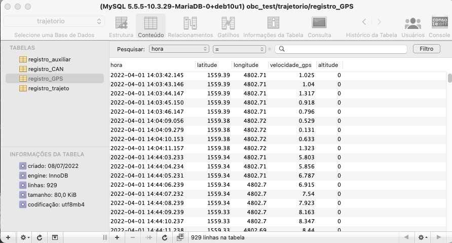
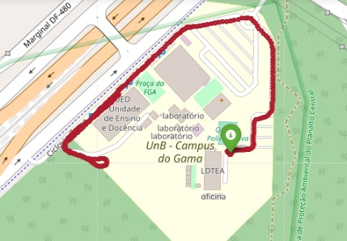
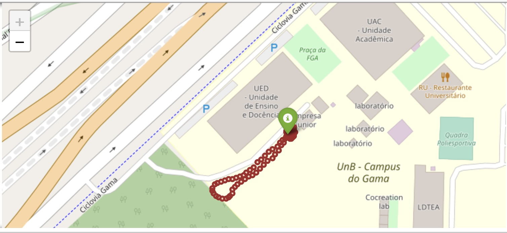
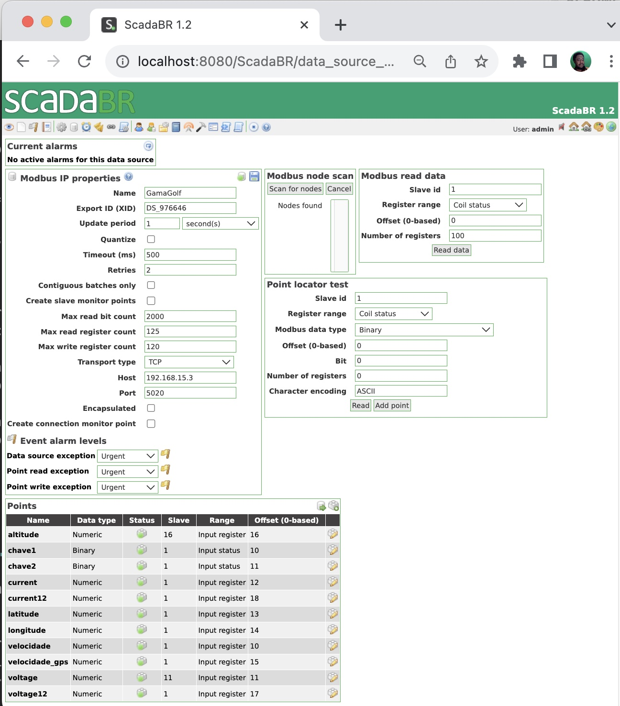
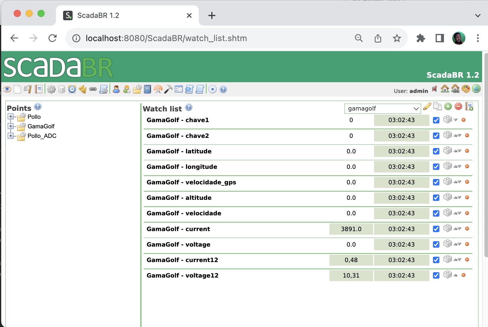

# Camada de Aplicação (5) 
Descrição da camada de aplicação 

A camada de aplicação deve pegar os dados armazenados OBC e disponibiliza-los para o usuário final de uma forma aproveitável.

Há várias maneiras de mostrar o dados. A primeira opção é mostrar os dados gravados no banco de dados. A outra opção é adquirir os dados em tempo real e mostra-los de forma dinâmica. 

A primeira opção pode ser implementado por meio de programas já prontos de pesquisa e manipulação de banco de dados como por exemplo DBeaver ou Sequel Pro.
 
Uma outra maneira de visualizar estes dados é por meio de uma interface customizado criado por exemplo no Jupyter Notebook usando Python. 

A segunda opção é mostrar os dados em tempo real e nessa opção deve ser usar um protocolo de comunicação MODBUS-IP que é mais apropriado para este fim

Para ter acesso ao banco de dados MariaDB de forma remota é necessário permitir o usuaro externo (de outro IP) para ter acesso ao banco de dados.

# 1. Acesso local (off-line)

# 1.1. Acesso ao MariaDB de forma remota 

Para permitir o acesso externo ao banco de dados MariaDB com o DBeaver ou Sequel Pro de um outro computador é necessário fazer os seguintes passos. 

1. entrar no banco de dados como superusuario com o comando `sudo mysql -p`
2. habilitar o acesso do usuario remoto ao banco de dados com o comando `MariaDB [(none)]> grant all privileges on *.* to 'debian'@'192.168.15.%' identified by 'sleutel';`
3. finalizar operação com `flush privileges;`

Com isso se pode permitir o acesso remoto (gastei umas 2 horas para lembrar disso quando mudei de computador).

Para conferir se os dados foram atualizados pode-se fazer uma pesquisa usando
`use information_schema;` e depois `MariaDB [information_schema]> select * from USER_PRIVILEGES;`

A figura a seguir mostra o acesso do Sequel Pro ao banco de dados no MariaDB



O programa Sequel Pro permite a filtragem dos dados de forma bastante direto e simples. Além disso há possibilidade de exportar os dados de vários formatos inclusive com Jason.

Este programa é mais simples que dbeaver e para o nosso aplicação atende para fazer buscas e filtragens rápidas.

Os dados podem ser gravados num arqquivo tipo CSV no computador e podem ser analisados. Um exemplo de disso é o [programa no jupyter notebook](GG_OBC_excell_upload.pdf)

```
#!/usr/bin/env python
# coding: utf-8
# # Programa para pegar percurso do GPS do OBC do GamaGolfe andando no campus Gama
# 
# Este programa baixa os dados armazenados em planilha de calculo e mostra o percurso.
# 
# versao novembro 2023 

import geopandas
import folium
import os
import time
import datetime
import sys
import pandas as pd

#########
# Abrir arquivo  - Não esquece de mudar o caminho para o arquivo no seu computador
#########

df = pd.read_csv('/Users/rudi/Documents/GitHub/GamaGolf/dados/dados_gama_bruto_7nov_2023.txt', sep='\t')

##########
# Seleciona os registros do arquivo
##########

inicio = '2023-11-08 16:23:34'
final  = '2023-11-08 16:30:00'
resultado = df[(df["hora"] > inicio)  & (df["hora"] < final)]
index_list = list(range(0,len(resultado)))
resultado.index=index_list

#########
# Monta tabelas para analizar os dados 
#########

len(resultado)
coord=[]
velocidade=[]
tempo=[]
altitude=[]
corrente=[]

for i in range(len(resultado)):    
    coord.append([resultado.latitude[i] , resultado.longitude[i] ])
    velocidade.append(resultado.velocidade[i])
    altitude.append(resultado.altitude[i])
    tempo.append(resultado.hora[i])   
    corrente.append(resultado.corrente[i])

map = folium.Map(location = coord[0], tiles='OpenStreetMap' , zoom_start = 17,width=750, height=500)  #crs='EPSG3857')##, ,  crs='EPSG4326') EPSG3857#, zoom_control=False)

folium.Marker(coord[0],popup="<i>Mt. Hood Meadows</i>", tooltip="Inicio", icon=folium.Icon(color="green")).add_to(map)
for i in range(len(coord)):
    folium.Circle( location=coord[i], tooltip=tempo[i], radius=2, color='brown', fill=True ).add_to( map )
map    

```

Alguns dados gravados podem ser acessados pelos links : 

[dados\_gps\_acelerometro\_7\_nov2023.csv](dados_gps_acelerometro_7_nov2023.csv)


[dados\_gama\_bruto\_7nov\_2023.txt](dados_gama_bruto_7nov_2023.txt)

O resultado está no mapa na figura a seguir.



## 1.2. Python Jupyter Notebook Colab

A construção de uma interface customizada para visualizar os dados do OBC é uma maneira bastante efetivo de analizar comportamento do veículo off-line. 

Essa interface pode ser construída em Python no Jupyter Notebook.

O programa a seguir mostra como se pode retirar os dados do GPS gravados no MariaDB, fazer uma filtragem para selecionar um intervalo de dados e depois mostrar os coordenados num mapa.
No final o programa mostra o perfil de velocidade e da altitude.

Este programa pode ser melhorado para fazer o pos-processamento dos dados e juntar os registros das diversas tabelas e montar uma interface com todos as medições de forma organizado e interligado. 


```python
#!/usr/bin/env python
# coding: utf-8
# Programa para pegar percurso do GPS do OBC do GamaGolfe andando no campus Gama
# http://localhost:8888/notebooks/src/GamaGolf_OnBoard_Computer_2023/GG_OBC_upload_SQL_2023_10_01.ipynb
# 
# Este programa baixa os dados armazenados no banco de dados MariaDB no OBC e mostra o percurso.
# Para baixar os dados é preciso que o GamaGolfe esteja no UED proximo ao roteador wifi do laboratório de termofluidos, pois o OBC está ligado neste roteador com endereço dinamico IP 192.168.1.100 
# O endereco do IP pode ser lido no display do OBC
# Versao 13 julho 2022
# versao 1 de outubro 2023 

import geopandas
import folium
import os
import time
import datetime
import sys
import mysql.connector
import pandas as pd
import matplotlib.pyplot as plt
import ipywidgets as widgets
from ipydatagrid import DataGrid
from ipywidgets import Button, HBox, VBox
```

```python
#########
# Abrir banco de dados
#########
conn = mysql.connector.connect(user='debian', password='sleutel', host='192.168.15.5', database='trajetorio') 
curs = conn.cursor()
query = ("SELECT * FROM registro_GPS") 
curs.execute(query)
resultado1 = curs.fetchall()
df = pd.DataFrame(resultado1)
datagrid=DataGrid(df, editable=True, layout={"heigth": "200px"})
datagrid
```


```python
# Seleciona a faixa de dados que quer processar marcando-o na tabela dinamica
datagrid.selected_cell_values
```


```python
ini=widgets.Text(
    value=str(datagrid.selected_cell_values[0]),
    placeholder=str(datagrid.selected_cell_values[0]),  #'Type something',
    description='Reg inicial: ',
    disabled=False   
)
fim=widgets.Text(
    value=str(datagrid.selected_cell_values[ len(datagrid.selected_cell_values)-1])   ,  #' ',
    placeholder='Type something',
    description='Reg final: ',
    disabled=False   
)
left_box = VBox([ini])
right_box = VBox([fim])
HBox([left_box, right_box])
```

```python
# Executa a busca filtrada no banco de dados
print(ini.value)
print(fim.value)
query = "SELECT * FROM `registro_GPS` WHERE `hora` BETWEEN '" + ini.value + "' AND '" + fim.value +"' LIMIT 0,1000"
print(query)
curs.execute(query)
resultado2 = curs.fetchall()
df = pd.DataFrame(resultado2)
DataGrid(df)
```

```python
coord=[]
for i in range(len(resultado2)):    
    coord.append([resultado2[i][1] , resultado2[i][2] ])

map = folium.Map(location = coord[0], tiles='OpenStreetMap' , zoom_start = 17,width=750, height=500, crs='EPSG3857') ##   crs='EPSG4326') #, zoom_control=False)

folium.Marker(coord[0],popup="<i>Mt. Hood Meadows</i>", tooltip="Inicio", icon=folium.Icon(color="green")).add_to(map)
for i in range(len(coord)):
    folium.Circle( location=coord[i], radius=2, color='brown', fill=True ).add_to( map )
map    
```

O resultado é o mapa mostrado a seguir.



# 2. Acesso on-line e real-time 

## 2.1. ScadaBR com Protocolo Modbus-IP

O acesso ao Computador de Bordo por meio do ScadaBR é possível quando o OBC está na mesma rede internet do Supervisório ScadaBR. 

O ScadaBR será utilizada para fazer alguma um monitoramento on line quando, por exemplo, o carro está no dinamometro e se precisa fazer uma avaliação. Ou quando a bateria está carregando no posto de recarga e se precisa avaliar a taxa de carga ou estado de carga da bateria.  

A figura a seguir mostra a tela de configuração do Modbus-IP do ScadaBR.



A tela para visualizar todos os variáveis é mostrada a seguir.




## 2.2. ScadaBR com Protocolo MQTT 
